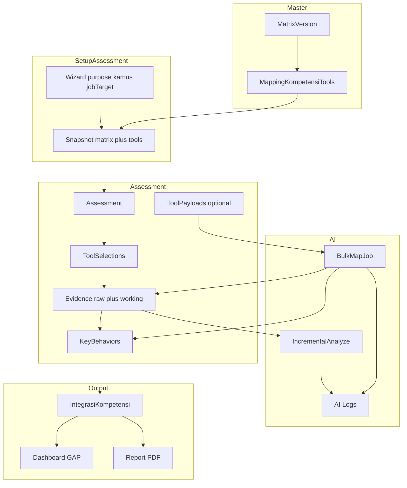

# Rencana pengembangan AI Assessment Support (dari firstbuild.md)

## Ringkasan pemahaman dokumen

Aplikasi ini mendukung **siklus assessment kompetensi**: pemetaan tool ke kompetensi lewat **matrix berversi (“kamus”)**, input **evidence** dan **key behavior (KB)**, **integrasi/pratinjau skor** (bukan nilai final), **dashboard GAP & Job Fit**, serta **laporan + export PDF**. **AI (OpenRouter)** membantu analisis/pemetaan dengan **logging audit** (`ais_log_ai`); keputusan final tetap assessor dan hasil AI harus bisa diedit/ditolak.

**Tambahan dari wawancara (domain bisnis):**

- **Kompetensi tidak “seragam otomatis” per peserta** — yang menentukan adalah **kamus** yang dipilih saat setup assessment, sesuai **tujuan asesmen** dan konteks klien. Empat kamus yang disebutkan: **Kompetensi 17 PTPN**, **11 PTPN**, **12 KBUMN**, **10 KBUMN** (masing-masing peruntukan berbeda: grup PTPN, swasta, BOD-1 PTPN, asesmen holding PTPN 2026, dll.). Setiap kamus membawa **RCL, peran (roles), dan rekomendasi** sendiri — dimodelkan sebagai bagian dari **versi matrix / paket kamus** (metadata + relasi ke konten RCL/rekomendasi), bukan hardcode satu matrix global.
- **Dua tujuan asesmen:** **Promosi** (naik satu tingkat di atas jabatan saat ini) vs **Talent mapping** (posisi existing). Ini mengunci **set tool default** (dinyatakan sebagai **kode** master; lihat tabel master di bawah):
  - **Promosi:** PA, INTRAY, LGD, Rencana Aksi, Managerial inventory, BEI (RA/MI perlu entri master atau keputusan pemetaan sebelum seed preset).
  - **Talent mapping:** PA, INTRAY, LGD, Managerial inventory, BEI (tanpa Rencana Aksi sesuai penjelasan; MI seperti di atas).
  - **Pengecualian:** untuk **job target BOD-3**, **tidak menggunakan INTRAY** — field assessment memicu **filter tool** dan validasi.
- **Dua skenario AI (keduanya harus terdukung):**
  1. **Incremental:** asesor memasukkan evidence per potongan → AI membantu analisis (rating/KB link) berbasis teks yang dimasukkan.
  2. **Bulk mapping:** data mentah dari berbagai tool (mis. PA, INTRAY, LGD, MI, RA, BEI, … — mengikuti kode `ais_alat_penilaian`) dimasukkan sekaligus → AI mengusulkan pemetaan ke kompetensi + KB → asesor **mengoreksi ringan**; peran asesor = **kontrol kualitas**.
- **Governance assessment center:** wajib **data mentah nyata** yang dianalisis. AI **tidak boleh** menggantikan fakta dengan inferensi bebas atau “menyederhanakan” tanpa jangkar teks. Disiapkan **kolom/konten konfirmatori**: AI menjelaskan **mengapa** cuplikan evidence relevan terhadap KB (untuk double-check asesor), dengan instruksi prompt yang memaksa **kutipan/rujukan ke teks mentah** dan flag jika tidak ada dukungan eksplisit.

**Prinsip teknis penting:** prefix tabel `ais_`, **nama tabel domain dalam Bahasa Indonesia** (lihat **Konvensi penamaan tabel** di bawah), hindari PII di prompt, versioning prompt & matrix, activity log untuk aksi admin, **pemisahan penyimpanan evidence mentah vs teks yang ditampilkan/diedit** (lihat bagian proses optimal di bawah).

### Konvensi penamaan tabel (`ais_` + Bahasa Indonesia)

| Fungsi | Nama tabel |
| ------ | ---------- |
| Pengguna / auth | `ais_pengguna` |
| Token reset kata sandi | `ais_token_reset_kata_sandi` |
| Sesi (driver database) | `ais_sesi` |
| Token API Sanctum | `ais_token_akses_pribadi` |
| Kelompok kompetensi | `ais_kelompok_kompetensi` |
| Kompetensi | `ais_kompetensi` |
| Tingkat / indikator kompetensi | `ais_tingkat_kompetensi` |
| Alat asesmen | `ais_alat_penilaian` |
| Versi matriks (kamus) | `ais_versi_matriks` |
| Pemetaan kompetensi–alat | `ais_pemetaan_kompetensi_alat` |
| Peserta | `ais_peserta` |
| Log aktivitas admin | `ais_log_aktivitas` |
| Log pemanggilan AI (fase berikut) | `ais_log_ai` (menggantikan istilah `ais_ai_logs`) |

**Catatan:** [documentation/firstbuild.md](c:\laragon\www\aiassisstedconsultan\documentation\firstbuild.md) dapat masih menyebut nama Inggris historis; **implementasi migrasi** memakai nama di kolom ini. Nama kolom (field) tetap dapat berbahasa Inggris untuk kompatibilitas kode kecuali ada kebijakan lain.

## Master data assessment tools (referensi resmi — input user)

Tabel ini menjadi **sumber benih (`MasterDataSeeder` / `ais_alat_penilaian`)**: kolom `code` unik stabil untuk integrasi, API, dan preset; `name` / `description` untuk UI; `is_active` mengikuti kolom Status.

| Code   | Nama                        | Deskripsi                                                                 | Status |
| ------ | --------------------------- | ------------------------------------------------------------------------- | ------ |
| BEI    | Behavioral Event Interview  | Wawancara berbasis perilaku untuk menggali pengalaman kerja dan kompetensi | Active |
| LGD    | Leaderless Group Discussion | Simulasi diskusi kelompok tanpa pemimpin formal                           | Active |
| PA     | Presentation Analysis       | Simulasi presentasi dan analisa peserta                                   | Active |
| INT    | Interview                   | Interview umum untuk validasi kompetensi                                  | Active |
| INTRAY | In-Tray Exercise            | Simulasi pengambilan keputusan dan prioritas kerja                        | Active |
| RP     | Role Play                   | Simulasi interaksi kerja sesuai skenario                                  | Active |
| CASE   | Case Analysis               | Analisa studi kasus untuk problem solving                                 | Active |

**Penyelarasan dengan wawancara & firstbuild.md:**

- Preset **Promosi / Talent mapping** dan pengecualian **BOD-3 tanpa In-Tray** dirujuk ke kode **`INTRAY`** (bukan label bebas).
- Istilah wawancara **“Problem analysis”** vs master **PA = Presentation Analysis**: saat implementasi, **kunci FK preset ke `code` PA`**; jika bisnis membedakan dua tool berbeda, tambahkan baris master baru (kode baru) setelah konfirmasi — jangan mengorbankan makna tanpa persetujuan domain.
- **Rencana Aksi** dan **Managerial inventory** disebut di wawancara tetapi **belum ada** di tabel tujuh tool di atas: sebelum seed preset lengkap, **tambahkan baris master** (mis. `RA`, `MI` + nama/deskripsi resmi) atau petakan ke tool existing — ini **keputusan domain** yang harus ditutup di Phase 1.
- Tool dari [documentation/firstbuild.md](c:\laragon\www\aiassisstedconsultan\documentation\firstbuild.md) yang tidak ada di tabel user (**mis. INT, RP, CASE** tetap ada di master) tetap dipakai untuk matrix per kamus bila dipetakan; tidak wajib masuk setiap preset.

## Master data kompetensi (referensi resmi — input user)

**Pemetaan ke skema Laravel:** prefix proyek `ais_*` — misalnya **`ais_kelompok_kompetensi`** (bukan nama tabel mentah `kelompok_kompetensi`) dan **`ais_kompetensi`** untuk baris `master_kompetensi`. Kolom `kelompok` pada master kompetensi di-resolve ke **`kelompok_kompetensi.id`** (atau `code` unik **INT / MNJ / LDR**) via FK; jangan mengandalkan string nama saja agar aman untuk seed dan filter.

**Catatan kode:** kode kelompok **`INT`** (Kompetensi Inti) **berbeda konteks** dari tool assessment **`INT`** (Interview) — dua domain berbeda (tabel berbeda), tidak bentrok selama relasi selalu memakai FK/id.

### Tabel: kelompok_kompetensi → `ais_kelompok_kompetensi`

| id | kode | nama |
| -- | ---- | ---- |
| 1 | INT | Kompetensi Inti |
| 2 | MNJ | Kompetensi Manajerial |
| 3 | LDR | Kompetensi Kepemimpinan |

### Tabel: master_kompetensi → `ais_kompetensi`

| kode | nama kompetensi | kelompok | definisi |
| ---- | --------------- | -------- | -------- |
| INF | Information Seeking | Kompetensi Inti | Keinginan dan upaya tambahan yang dikeluarkan untuk mengetahui, mencari dan mengumpulkan lebih banyak informasi tentang sesuatu atau seseorang atau pemasalahan, maupun tentang pelaksanaan pekerjaan dan pengambilan keputusan. |
| RSL | Resilience | Kompetensi Inti | Kemampuan untuk bersikap positif dan menunjukkan kegigihan dalam menghadapi masalah, tekanan, kekecewaan, kritik, dan atau penolakan sehingga dapat bersikap profesional dan mempertahankan kinerjanya. |
| ACH | Achievement Orientation | Kompetensi Inti | Kemampuan untuk bekerja dengan baik atau melampaui target atau standar prestasi baik standar diri pribadi maupun standar keunggulan kinerja. |
| CFO | Concern for Order | Kompetensi Inti | Kemampuan untuk memastikan ketepatan dan kualitas proses maupun hasil kerja dalam bentuk tindakan seperti pemantauan dan pengecekan pekerjaan atau informasi. |
| ORC | Organizational Commitment | Kompetensi Inti | Kemampuan untuk menyelaraskan perilaku pribadi dengan kebutuhan, prioritas dan sasaran organisasi dengan mendahulukan misi organisasi dari kepentingan pribadi. |
| ETO | Ethical Oriented | Kompetensi Inti | Kemampuan untuk bertindak sebagai pribadi yang bertanggung jawab dan berorientasi terhadap aturan, nilai-nilai, dan budaya perusahaan dalam segala situasi. |
| BCR | Building Collaborative Relationship | Kompetensi Manajerial | Kemampuan untuk mengembangkan, mempertahankan, dan memperkuat partnership dengan orang lain baik internal maupun eksternal organisasi. |
| BSV | Business Savvy | Kompetensi Manajerial | Kemampuan untuk mengidentifikasi dan menangkap peluang-peluang yang mengarah pada peningkatan kinerja dan pengembangan bisnis dengan memperhitungkan risikonya. |
| CSF | Customer Focus | Kompetensi Manajerial | Secara proaktif memberikan pelayanan yang bernilai tambah dan lebih dari yang diharapkan pelanggan eksternal dan internal. |
| STO | Strategic Orientation | Kompetensi Manajerial | Kemampuan untuk merumuskan dan atau menerjemahkan visi dan misi perusahaan ke dalam strategi serta langkah-langkah yang jelas. |
| STM | Sustainability Mindset | Kompetensi Manajerial | Kemampuan untuk memperhatikan aspek-aspek keberlanjutan dan pertumbuhan perusahaan dalam setiap pengambilan keputusan. |
| EXF | Execution Focused | Kompetensi Manajerial | Kemampuan untuk menetapkan langkah tindakan dan menjalankannya dengan mempertimbangkan berbagai sumber daya serta risiko. |
| DGL | Digital Literate | Kompetensi Manajerial | Kemampuan untuk mencari, mengidentifikasi, mengevaluasi dan menggunakan informasi serta teknologi digital untuk meningkatkan efektivitas kerja. |
| CIN | Creativity & Innovation | Kompetensi Kepemimpinan | Kemampuan untuk menghasilkan dan menggunakan ide baru yang bernilai tambah dengan menerapkan metode penyelesaian yang kreatif dan inovatif. |
| TRL | Transformational Leadership | Kompetensi Kepemimpinan | Kemampuan untuk mempengaruhi dan menggerakkan orang lain dalam membangun iklim perubahan dan merumuskan tujuan yang menantang. |
| NEP | Nurturing and Empowering People | Kompetensi Kepemimpinan | Kemampuan untuk membina dan mengembangkan individu serta kelompok sesuai dengan kebutuhan pekerjaan saat ini dan masa depan. |
| MED | Managing Equality & Diversity | Kompetensi Kepemimpinan | Kemampuan untuk menerima, mengelola, dan memanfaatkan keragaman para pemangku kepentingan untuk meningkatkan nilai tambah perusahaan. |

**Implementasi vs firstbuild.md:** [documentation/firstbuild.md](c:\laragon\www\aiassisstedconsultan\documentation\firstbuild.md) menyebut `ais_kompetensi` dengan `competency_code`, `name`, `category`, `max_level`, `is_active` — **`category` diganti atau dilengkapi** dengan **`competency_group_id`** (FK ke `ais_kelompok_kompetensi`); **`definisi`** disimpan sebagai kolom `definition` (text). **`ais_tingkat_kompetensi`** tetap anak dari `ais_kompetensi` per dokumen. **Kamus 17/11/12/10** memetakan **subset atau seluruh** 17 kompetensi ini (atau perluasan) per `ais_versi_matriks`; matrix yang berbeda boleh mengaktifkan/menonaktifkan baris kompetensi tanpa menghapus master.

## Master data indikator perilaku (`master_indikator_perilaku` → `ais_tingkat_kompetensi`)

**Pemetaan implementasi:** satu baris per **(kompetensi, level)**. Kolom firstbuild: `competency_id` (FK), `level` (1–6), `behavioral_indicator` (teks **Indikator**). Kolom `label` / `description` opsional (boleh kosong atau duplikat ringkas); **`max_level`** pada `ais_kompetensi` = **6** untuk kompetensi yang punya 6 level ini.

**Cakupan data user:** indikator lengkap untuk **15** kode (**INF, RSL, ACH, CFO, ORC, ETO, CSF, STO, STM, EXF, DGL, CIN, TRL, NEP, MED**). **Belum ada** blok level 1–6 untuk **BCR** dan **BSV** pada input ini — sebelum production seed, **lengkapi dari sumber resmi** atau nonaktifkan kedua kompetensi di kamus hingga datanya ada.

| Kode | Level | Indikator |
| ---- | ----- | --------- |
| INF | 1 | Mencari informasi tambahan dan tidak hanya menggantungkan pada informasi yang sudah ada dalam menghadapi permasalahan |
| INF | 2 | Menggali informasi lebih banyak dengan menanyakan langsung kepada pihak-pihak yang mengetahui permasalahan |
| INF | 3 | Selalu mencari tahu latar belakang terjadinya sesuatu hal dan menggali informasi lebih mendalam |
| INF | 4 | Meminta pendapat dari orang lain untuk mendapatkan informasi pendukung, data tambahan, opini, dan pengalaman |
| INF | 5 | Memastikan kebenaran dan keutuhan informasi yang diterima melalui sumber-sumber resmi |
| INF | 6 | Membangun sistem untuk mengumpulkan informasi terstruktur dan mengoptimalkan orang lain |
| RSL | 1 | Berusaha mengendalikan emosi dalam menghadapi tekanan dan kesulitan agar tidak mempengaruhi kinerja |
| RSL | 2 | Mempertahankan kinerja dengan tetap fokus pada tugas, bersikap ulet dan tidak mudah menyerah |
| RSL | 3 | Mempertahankan sikap positif, menelaah situasi dari banyak sisi dan terbuka terhadap berbagai kemungkinan |
| RSL | 4 | Konsisten menunjukkan tekad dan kemauan untuk mengambil sikap meski tidak mendapat dukungan |
| RSL | 5 | Mengelola tekanan dan kesulitan menjadi energi positif, mencari alternatif lain dan solusi |
| RSL | 6 | Menularkan sikap positif dan kegigihan pada anggota tim, menciptakan lingkungan yang kondusif |
| ACH | 1 | Memiliki kemampuan dan kemauan bekerja untuk mencapai target |
| ACH | 2 | Bekerja keras untuk mencapai dan melampaui standar kinerja yang diterapkan |
| ACH | 3 | Menetapkan tindakan dalam meraih sasaran diri sendiri dan tim |
| ACH | 4 | Mengoptimalkan penggunaan sumber daya untuk pencapaian target |
| ACH | 5 | Mempertimbangkan kemungkinan risiko bisnis yang akan terjadi |
| ACH | 6 | Fokus pada perbaikan berkelanjutan dan menciptakan nilai tambah |
| CFO | 1 | Memiliki perhatian terhadap aturan yang berlaku |
| CFO | 2 | Perhatian terhadap kejelasan tugas, tanggung jawab, wewenang, dan sasaran kerja |
| CFO | 3 | Mendapatkan dan memeriksa keakuratan data yang terkait dengan tugasnya |
| CFO | 4 | Melaksanakan tugas berdasarkan data yang akurat |
| CFO | 5 | Melakukan evaluasi pekerjaan untuk meningkatkan ketepatan sesuai sistem yang berlaku |
| CFO | 6 | Mengembangkan dan menggunakan sistem untuk melacak data |
| ORC | 1 | Mengenali dan menyelaraskan perilaku pribadi dengan kebutuhan perusahaan |
| ORC | 2 | Menyadari dan menghargai jasa yang diberikan perusahaan kepada dirinya |
| ORC | 3 | Bersedia membantu orang lain untuk menyelesaikan tugas guna mencapai tujuan perusahaan |
| ORC | 4 | Mendukung visi dan misi perusahaan dengan memahami kebutuhan dan kondisi perusahaan |
| ORC | 5 | Menempatkan kepentingan perusahaan di atas kepentingan pribadi atau kelompok |
| ORC | 6 | Menjadi teladan dalam menjaga komitmen terhadap organisasi |
| ETO | 1 | Memahami aturan dan etika kerja yang berlaku |
| ETO | 2 | Menjalankan pekerjaan sesuai aturan dan prosedur |
| ETO | 3 | Konsisten antara ucapan dan tindakan |
| ETO | 4 | Menjaga integritas dalam berbagai situasi kerja |
| ETO | 5 | Menjadi contoh perilaku etis di lingkungan kerja |
| ETO | 6 | Mendorong budaya etika dan kepatuhan di organisasi |
| CSF | 1 | Memahami kebutuhan pelanggan baik internal maupun eksternal |
| CSF | 2 | Menerima dan memantau umpan balik yang diberikan pelanggan |
| CSF | 3 | Menerjemahkan umpan balik dari pelanggan ke dalam rencana yang dapat dijalankan |
| CSF | 4 | Memberikan alternatif pemecahan masalah sesuai tuntutan dan kebutuhan pelanggan |
| CSF | 5 | Melakukan tindak lanjut untuk mengantisipasi kebutuhan pelanggan di masa depan |
| CSF | 6 | Membangun budaya pelayanan yang berorientasi pelanggan |
| STO | 1 | Memahami visi dan misi perusahaan |
| STO | 2 | Memahami strategi dan arah bisnis perusahaan |
| STO | 3 | Menghubungkan aktivitas kerja dengan sasaran strategis perusahaan |
| STO | 4 | Menyusun langkah strategis dalam mendukung pencapaian tujuan perusahaan |
| STO | 5 | Mengidentifikasi tantangan dan peluang strategis perusahaan |
| STO | 6 | Mengembangkan strategi jangka panjang untuk mempertahankan daya saing |
| STM | 1 | Memahami pentingnya keberlanjutan perusahaan |
| STM | 2 | Mempertimbangkan dampak jangka panjang dalam pekerjaan |
| STM | 3 | Menyesuaikan tindakan dengan prinsip keberlanjutan |
| STM | 4 | Mengintegrasikan aspek keberlanjutan dalam pengambilan keputusan |
| STM | 5 | Mengembangkan inisiatif yang mendukung pertumbuhan berkelanjutan |
| STM | 6 | Menjadi penggerak budaya sustainability di organisasi |
| EXF | 1 | Menyelesaikan tugas sesuai instruksi |
| EXF | 2 | Menentukan prioritas pekerjaan |
| EXF | 3 | Menjalankan rencana kerja secara konsisten |
| EXF | 4 | Mengelola sumber daya untuk memastikan target tercapai |
| EXF | 5 | Mengantisipasi hambatan dan risiko pelaksanaan |
| EXF | 6 | Memastikan implementasi berjalan efektif dan efisien |
| DGL | 1 | Menggunakan teknologi digital dasar dalam pekerjaan |
| DGL | 2 | Mencari dan menggunakan informasi digital yang relevan |
| DGL | 3 | Mengevaluasi validitas informasi digital |
| DGL | 4 | Menggunakan teknologi untuk meningkatkan efektivitas kerja |
| DGL | 5 | Mengoptimalkan penggunaan teknologi untuk mendukung proses bisnis |
| DGL | 6 | Mendorong transformasi digital dalam pekerjaan dan organisasi |
| CIN | 1 | Menunjukkan keterbukaan terhadap ide baru |
| CIN | 2 | Mengusulkan perbaikan sederhana dalam pekerjaan |
| CIN | 3 | Mengembangkan alternatif solusi yang kreatif |
| CIN | 4 | Mengimplementasikan ide baru yang memberikan nilai tambah |
| CIN | 5 | Mendorong inovasi untuk meningkatkan efektivitas organisasi |
| CIN | 6 | Menciptakan budaya inovasi yang berkelanjutan |
| TRL | 1 | Memberikan arahan kerja kepada anggota tim |
| TRL | 2 | Memotivasi anggota tim dalam bekerja |
| TRL | 3 | Menggerakkan tim untuk mencapai target bersama |
| TRL | 4 | Menjadi agen perubahan di lingkungan kerja |
| TRL | 5 | Membangun visi perubahan yang jelas dan inspiratif |
| TRL | 6 | Menginspirasi organisasi dalam menghadapi transformasi bisnis |
| NEP | 1 | Memberikan dukungan kepada anggota tim |
| NEP | 2 | Membantu pengembangan kemampuan individu |
| NEP | 3 | Memberikan coaching dan feedback secara berkala |
| NEP | 4 | Memberikan kesempatan belajar dan pengembangan |
| NEP | 5 | Mengembangkan potensi individu untuk kebutuhan masa depan |
| NEP | 6 | Membangun budaya pembelajaran dan pemberdayaan |
| MED | 1 | Menghargai perbedaan individu |
| MED | 2 | Bersikap terbuka terhadap keberagaman |
| MED | 3 | Membangun hubungan kerja yang inklusif |
| MED | 4 | Mengelola keberagaman untuk meningkatkan kerjasama |
| MED | 5 | Memanfaatkan keberagaman sebagai nilai tambah organisasi |
| MED | 6 | Menjadi penggerak budaya kerja yang inklusif dan setara |

**AI & KB:** teks **Indikator** ini menjadi **referensi key behavior level** yang dikirim ke prompt (per kompetensi) agar saran AI selaras kamus; `ais_perilaku_kunci` (rencana; setara firstbuild `ais_key_behaviors`) boleh merujuk `competency_level_id` opsional untuk jejak audit “indikator mana yang dianggap terpenuhi”.

## State proyek saat ini vs target

| Aspek     | Sekarang                                                                                                                                          | Target (dokumen)                                                                                                                                                                                   |
| --------- | ------------------------------------------------------------------------------------------------------------------------------------------------- | -------------------------------------------------------------------------------------------------------------------------------------------------------------------------------------------------- |
| Framework | [composer.json](c:\laragon\www\aiassisstedconsultan\composer.json) Laravel ^12, PHP ^8.2                                                          | PHP 8.3+ (disarankan selaraskan environment; composer bisa dinaikkan saat Phase 1)                                                                                                                 |
| Auth      | Belum                                                                                                                                             | Session + [laravel/sanctum](https://laravel.com/docs/sanctum) untuk token; role `admin` / `konsultan`                                                                                              |
| DB        | [0001_..._create_users_table.php](c:\laragon\www\aiassisstedconsultan\database\migrations\0001_01_01_000000_create_users_table.php) membuat `ais_pengguna`, token reset, `ais_sesi` | Tabel domain **`ais_*` dalam Bahasa Indonesia**; model [app/Models/User.php](c:\laragon\www\aiassisstedconsultan\app\Models\User.php) memakai `protected $table = 'ais_pengguna'` |
| Frontend  | [package.json](c:\laragon\www\aiassisstedconsultan\package.json): Tailwind 4 + Vite                                                               | Tambah **AlpineJS** & **SweetAlert2** saat UI assessment/admin                                                                                                                                     |
| Routing   | Hanya [routes/web.php](c:\laragon\www\aiassisstedconsultan\routes\web.php) welcome                                                                | Route terkelompok per peran + API/import CSV sesuai dokumen                                                                                                                                        |
| Domain    | Tidak ada                                                                                                                                         | Model, policy, service layer sesuut bagian 19 dokumen                                                                                                                                              |

## Keputusan arsitektur awal (disarankan)

1. **Satu sumber kebenaran skema:** migrasi Laravel untuk seluruh entitas di dokumen (sections 5–13), dengan indeks unik `(matrix_version_id, competency_id, assessment_tool_id)` pada mapping. **Master kompetensi:** `ais_kelompok_kompetensi` (3 baris INT/MNJ/LDR) + `ais_kompetensi` (17 baris kode INF…MED + `definition` + FK kelompok) + **`ais_tingkat_kompetensi`** (6 level × 15 kompetensi terisi dari **Master data indikator perilaku**; **BCR/BSV** menunggu data). **Perluas** `ais_versi_matriks` (atau tabel terkait) dengan atribut **jenis kamus / kode paket** (17, 11, 12, 10), **konteks penggunaan** (teks untuk admin), dan relasi ke **RCL / role set / template rekomendasi** agar satu versi matrix = satu “paket” lengkap sesuai wawancara.
2. **Enum/status:** `AssessmentStatus` (draft, in_progress, integrated, finalized) + **`AssessmentPurpose`** (promosi, talent_mapping) + **`JobTargetConstraint`** (mis. `bod3_no_intray`) untuk aturan tool.
3. **Kebijakan tool:** tabel atau config versi-bounded **`ais_tool_presets`** (atau JSON di matrix) yang mendefinisikan **tool yang diizinkan/wajib** per `purpose` + flag pengecualian; saat membuat assessment, sistem **menyalin snapshot** ke `ais_assessment_tool_selections` agar perubahan matrix masa depan tidak mengubah assessment lama.
4. **Evidence dua lapis:** minimal kolom **`evidence_raw`** (isi mentah dari assessment center / upload, tidak diubah AI) dan **`evidence_working`** (teks yang boleh diedit asesor). AI hanya membaca `evidence_raw` (dan metadata tool/sumber); output disimpan di kolom terpisah (`ai_*`, `ai_kb_link_rationale` / confirmatory). Validasi UI: peringatan jika working menyimpang jauh dari raw tanpa konfirmasi.
5. **Bulk ingest:** tabel **`ais_assessment_tool_payloads`** (assessment_id, tool_id, `payload_raw` text/json, checksum, uploaded_by, `processed_at`) + job `MapEvidenceFromBulkJob` yang memanggil `AISuggestionService::mapBulk()` dengan output **proposal** (baris evidence/KB sementara status `draft_ai`) yang harus **disetujui/di-edit** asesor sebelum jadi bukti final.
6. **Struktur layanan:** `app/Services/AI` — pisahkan **prompt** “incremental analyze” vs “bulk map”; keduanya memakai **PromptManager** + versi; **ResponseParser** menghasilkan struktur yang sama (level, KB candidates, **quotes_span** ke substring raw jika memungkinkan). Queue untuk semua panggilan berat.
7. **Activity log:** tetap seperti sebelumnya; tambahkan event `assessment.bulk_import`, `ai.bulk_map_applied`, `evidence.raw_amended` jika perlu audit.

## Proses optimal mengakomodasi wawancara (ringkas)

1. **Setup assessment (wizard):** pilih **peserta** → **tujuan** (Promosi / Talent mapping) → **kamus** (matrix version 17/11/12/10) → **job target** (untuk memicu aturan BOD-3 tanpa In-Tray) → sistem **menyiapkan tool yang diizinkan** dan **snapshot mapping** kompetensi–tool.
2. **Input data:**  
   - **Jalur A:** asesor entry per evidence; simpan **raw** = yang diketik/upload; tombol “Analisis AI” memakai raw.  
   - **Jalur B:** unggah/isi **payload per tool** (per `assessment_tool_id` / kode); job AI menghasilkan **draft pemetaan** ke kompetensi/KB; asesor review grid **accept/edit/reject** per baris.
3. **AI:** prompt mewajibkan **kutipan dari raw** untuk setiap klaim; field **confirmatory** (“mengapa ini menjawab KB X”) terisi otomatis; jika tidak ada dukungan teks, model mengembalikan **low confidence / tidak memetakan**.
4. **Integrasi & laporan:** hanya KB/evidence yang **disahkan asesor** masuk perhitungan; laporan PDF bisa menampilkan **raw** (atau lampiran) sesuai kebijakan.

## Alur data tingkat tinggi (MVP + dual mode AI)

## Fase implementasi (selaras section 20 dokumen)

### Phase 1 — Foundation

- Install **Sanctum**; setup login/logout Blade; middleware role; policies dasar (admin vs konsultan).
- Ganti/replace migrasi user ke **`ais_pengguna`** + kolom `role`.
- CRUD/master: peserta, **kelompok kompetensi** (3 baris), **kompetensi** (17 baris + `definition`), **`ais_tingkat_kompetensi`** — seed **90 baris** indikator (15 kode × 6 level) dari **Master data indikator perilaku**; lengkapi **BCR + BSV** (12 baris) saat data resmi ada; set `max_level = 6` pada kompetensi yang berindikator lengkap, **alat penilaian** — seed **tujuh alat** ke **`ais_alat_penilaian`** sesuai **Master data assessment tools**; tutup gap **RA / MI** pada master alat sebelum preset Promosi lengkap.
- **Matrix versions = kamus:** field/metadata untuk **paket 17/11/12/10**, konteks penggunaan, dan struktur data **RCL + roles + rekomendasi** (tabel anak atau JSON terversi, yang penting bisa di-version bersama matrix).
- **Tool presets:** definisi tool yang diizinkan per **purpose** (array **kode** FK ke master) + aturan **exclude INTRAY untuk BOD-3**; admin bisa override di matrix jika kebutuhan berubah.
- UI grid `/competency-tool-matrix` (filter, required, weight, clone, bulk save) + **activity logs** `/activity-logs`.
- Seeder: empat kamus awal (atau stub), tool master, preset Promosi vs Talent mapping.

### Phase 2 — Assessment Core

- **Wizard pembuatan assessment:** `purpose`, `matrix_version_id` (kamus), `job_target_flags` (mis. BOD-3), partisipan, assessor; **generate `ais_assessment_tool_selections`** dari preset + pengecualian otomatis.
- Status lifecycle, validasi: evidence hanya untuk **tool yang dipilih**; KB hanya jika **mapping snapshot** aktif.
- **Evidence:** kolom **raw** vs **working**; riwayat opsional untuk audit perubahan besar.
- **Bulk:** UI unggah/isi payload per tool → antre job → halaman review proposal AI.
- Endpoint **POST `/participants/import-csv`** (koma/semicolon, upsert `participant_code`).

### Phase 3 — AI Integration

- OpenRouter + **feature flag**; **dua jalur layanan:** incremental (`analyzeEvidence`) dan bulk (`proposeMappingsFromPayloads`).
- Output wajib: level/saran, **confidence**, **alasan**, **`ai_kb_link_rationale` / confirmatory** (menjawab KB mana dan **kutipan** dari raw); simpan ke `ais_bukti_penilaian` / `ais_perilaku_kunci` (rencana) / tabel proposal sementara.
- Prompt governance: instruksi eksplisit **no hallucination**, **quote-only** untuk klaim fakta; parser memvalidasi ada substring kutipan di raw (jika tidak, tandai invalid/low confidence).
- **`ais_log_ai`** untuk setiap call; timeout, retry, rate limit.

### Phase 4 — Integration Engine

- Layanan integrasi berbobot pada `ais_integrasi_kompetensi`; hanya KB **disahkan asesor** + mapping snapshot aktif; **preview** GAP dan Job Fit %; rekomendasi memakai **template per kamus** (RCL/roles) jika sudah ada di data master.
- Dashboard MVP: tabel kompetensi, target vs capaian, rekomendasi (Fit / Development / Not Fit), ringkasan yang bisa diedit; filter/indikator **sumber** (entry manual vs bulk AI).

### Phase 5 — Reporting

- Narrative generator (template + editable); ringkasan kompetensi, GAP, rekomendasi; export **DomPDF atau Snappy** (pilih satu di awal fase untuk mengurangi duplikasi layout).

### Phase 6 — QA & Stabilization

- Feature tests: wizard purpose/kamus/BOD-3, preset tool, evidence raw vs working, bulk mapping review, validasi matrix/KB, report; regresi kompatibilitas versi matrix; tes AI: fallback/timeout/parser, **validasi kutipan vs raw**.
- Review queue worker & logging di staging.

## Urutan prioritas praktis (section 22)

Sesuai dokumen: **Auth & roles → Master data → Matrix versioning → Assessment flow → Evidence → AI → Integration → Dashboard → Reporting → PDF**.

## Kriteria sukses MVP (section 23 + wawancara)

Checklist akhir: alur assessment end-to-end dengan **pemilihan kamus dan tujuan**, tool otomatis sesuai aturan **termasuk tanpa In-Tray untuk BOD-3**, evidence per tool × kompetensi dengan **raw terjaga**, **dua mode AI** (incremental + bulk) dengan **review asesor**, kolom **konfirmatori/kutipan** terisi konsisten, rekomendasi AI + editable/ditolak, integrasi kompetensi jalan, dashboard GAP & Job Fit, laporan editable + PDF, keputusan final manual, audit AI lengkap.

## File/konfigurasi yang akan banyak disentuh (nanti saat eksekusi)

- `database/migrations/*` (seluruh `ais_*`)
- `app/Models/*`, `app/Policies/*`, `app/Http/Controllers/*`, `routes/web.php` (+ `api.php` jika perlu Sanctum API)
- `app/Services/`**, `resources/views/**`, `resources/js/app.js` (Alpine)
- `.env` / `config/services.php` untuk OpenRouter

Tidak ada perubahan kode pada tahap ini (mode perencanaan); setelah Anda setujui rencana, eksekusi dimulai dari **Phase 1** dengan migrasi `ais_*` dan auth Sanctum.