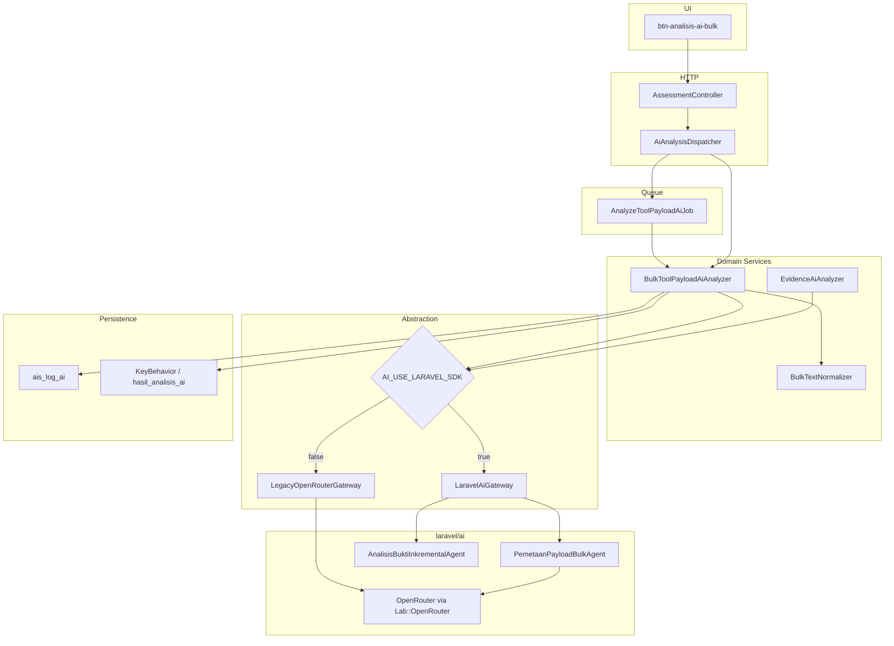

# Rencana implementasi Laravel AI SDK

## Konteks saat ini

- **Stack:** Laravel 12, PHP 8.2 — belum ada `laravel/ai` di [`composer.json`](c:\laragon\www\aiassisstedconsultan\composer.json).
- **Lapisan AI custom:**
  - [`app/Services/Ai/OpenRouterClient.php`](c:\laragon\www\aiassisstedconsultan\app\Services\Ai\OpenRouterClient.php) — HTTP + fallback model manual
  - [`app/Services/Ai/BulkToolPayloadAiAnalyzer.php`](c:\laragon\www\aiassisstedconsultan\app\Services\Ai\BulkToolPayloadAiAnalyzer.php) — bulk payload
  - [`app/Services/Ai/EvidenceAiAnalyzer.php`](c:\laragon\www\aiassisstedconsultan\app\Services\Ai\EvidenceAiAnalyzer.php) — bukti inkremental
  - [`app/Services/Ai/AiAnalysisDispatcher.php`](c:\laragon\www\aiassisstedconsultan\app\Services\Ai\AiAnalysisDispatcher.php) + jobs [`AnalyzeToolPayloadAiJob`](c:\laragon\www\aiassisstedconsultan\app\Jobs\AnalyzeToolPayloadAiJob.php), [`AnalyzeEvidenceAiJob`](c:\laragon\www\aiassisstedconsultan\app\Jobs\AnalyzeEvidenceAiJob.php)
  - [`app/Support/AiModelCatalog.php`](c:\laragon\www\aiassisstedconsultan\app\Support\AiModelCatalog.php) — daftar model + `rantaiFallback()`
  - [`app/Services/Ai/AiModelJsonParser.php`](c:\laragon\www\aiassisstedconsultan\app\Services\Ai\AiModelJsonParser.php) — parse respons JSON
- **Konfig aplikasi:** [`config/ai.php`](c:\laragon\www\aiassisstedconsultan\config\ai.php) (aktif, OpenRouter, queue, throttle, timeout per model).
- **Domain yang tidak boleh hilang:** [`BulkTextNormalizer`](c:\laragon\www\aiassisstedconsultan\app\Support\BulkTextNormalizer.php), validasi kutipan verbatim, filter kompetensi via `CompetencyToolMapping`, penyimpanan PK / `hasil_analisis_ai`, tabel [`ais_log_ai`](c:\laragon\www\aiassisstedconsultan\app\Models\AiLog.php).

## Prinsip migrasi

| Pertahankan | Ganti / serap ke SDK |
|-------------|----------------------|
| Normalisasi & validasi kutipan | `OpenRouterClient` + loop fallback |
| Prompt bisnis + transaksi DB | Parse JSON manual (sebagian → structured output) |
| `AiModelCatalog`, dropdown UI | — |
| `AiAnalysisDispatcher` + jobs | Duplikasi HTTP retry/timeout |
| Audit `ais_log_ai` | — |

**Strategi:** feature flag `AI_USE_LARAVEL_SDK` (default `false` sampai bulk stabil di staging).

## Arsitektur target



---

## Fase 0 — Persiapan

- Branch `feature/laravel-ai-sdk`.
- Tambah `.env`: `AI_USE_LARAVEL_SDK=false`.
- Pastikan `.env` valid: `AI_OPENROUTER_MODELS` **harus dalam tanda kutip** jika label ada spasi.
- Baseline test: [`tests/Feature/AiQueueAndSchemaTest.php`](c:\laragon\www\aiassisstedconsultan\tests\Feature\AiQueueAndSchemaTest.php), [`tests/Feature/AiEvidenceAnalysisTest.php`](c:\laragon\www\aiassisstedconsultan\tests\Feature\AiEvidenceAnalysisTest.php), [`tests/Unit/OpenRouterFallbackTest.php`](c:\laragon\www\aiassisstedconsultan\tests\Unit\OpenRouterFallbackTest.php).

---

## Fase 1 — Instalasi & fondasi (flag mati)

**1. Paket**

```bash
composer require laravel/ai
php artisan vendor:publish --provider="Laravel\Ai\AiServiceProvider"
php artisan migrate   # tabel agent_conversations (opsional, tidak wajib untuk MVP)
```

**2. Konfigurasi OpenRouter** di `config/ai.php` (paket Laravel):

- Provider `openrouter`: key dari `AI_OPENROUTER_API_KEY`, `url` = `https://openrouter.ai/api/v1`.
- Default model mengikuti `OPENROUTER_MODEL` / [`AiModelCatalog`](c:\laragon\www\aiassisstedconsultan\app\Support\AiModelCatalog.php).

**3. Perluas [`config/ai.php`](c:\laragon\www\aiassisstedconsultan\config\ai.php) aplikasi** (jangan hapus `queue`, `throttle`):

```php
'use_laravel_sdk' => env('AI_USE_LARAVEL_SDK', false),
```

**4. Abstraksi gateway** — file baru:

| File | Peran |
|------|--------|
| `app/Contracts/Ai/StructuredChatGateway.php` | Interface: `promptStructured(agentClass, userMessage, model, failoverModels): array` |
| `app/Services/Ai/LegacyOpenRouterGateway.php` | Delegasi ke `OpenRouterClient` existing |
| `app/Services/Ai/LaravelAiGateway.php` | Wrap agent SDK (fase 2) |

Binding di [`app/Providers/AppServiceProvider.php`](c:\laragon\www\aiassisstedconsultan\app\Providers\AppServiceProvider.php) berdasarkan `config('ai.use_laravel_sdk')`.

**Deliverable:** aplikasi boot, semua test hijau, perilaku produksi tidak berubah.

---

## Fase 2 — Agent bulk + structured output

**1. Buat agent**

```bash
php artisan make:agent PemetaanPayloadBulk --structured
```

`app/Ai/Agents/PemetaanPayloadBulkAgent.php`:

- `instructions()` — pindahkan system prompt dari [`BulkToolPayloadAiAnalyzer`](c:\laragon\www\aiassisstedconsultan\app\Services\Ai\BulkToolPayloadAiAnalyzer.php) (verbatim, max 12 usulan, dll.).
- `schema()` — `usulan[]` dengan: `kode_kompetensi`, `ringkasan`, `kutipan`, `alasan`, `keyakinan`, `tingkat`, `teks_perilaku`, `konfirmatori`.
- Runtime: `provider` = `Lab::OpenRouter`, `timeout` / `maxTokens` dari `config/ai.php` (`batas_waktu_per_model_detik`, `maks_token_keluaran_bulk`).

**2. Implementasi [`LaravelAiGateway`](c:\laragon\www\aiassisstedconsultan\app\Services\Ai\LaravelAiGateway.php)**

```php
$agent->prompt(
    $userMessage,
    provider: Lab::OpenRouter,
    model: AiModelCatalog::rantaiFallback($namaModel), // array → failover SDK
    timeout: config('ai.openrouter.batas_waktu_per_model_detik'),
);
```

Ini menggantikan [`OpenRouterClient::chatCompletionDenganFallback`](c:\laragon\www\aiassisstedconsultan\app\Services\Ai\OpenRouterClient.php) untuk jalur SDK.

**3. Refactor [`BulkToolPayloadAiAnalyzer`](c:\laragon\www\aiassisstedconsultan\app\Services\Ai\BulkToolPayloadAiAnalyzer.php)**

- Inject `StructuredChatGateway`.
- Setelah respons SDK: **tetap** jalankan `kompetensiDiperbolehkan()`, `BulkTextNormalizer::selesaikanKutipan()`, dedupe, transaksi PK.
- Pertahankan [`AiModelJsonParser`](c:\laragon\www\aiassisstedconsultan\app\Services\Ai\AiModelJsonParser.php) sebagai fallback jika structured output kosong/invalid (edge case markdown).

**4. Logging [`ais_log_ai`](c:\laragon\www\aiassisstedconsultan\app\Models\AiLog.php)**

- Opsi A (MVP): log eksplisit di analyzer setelah gateway (metadata: `model_berhasil`, `dicoba_model`, `latency_ms`, `usage`).
- Opsi B: listener `AgentPrompted` → `app/Listeners/CatatAiLogDariSdk.php`.

**5. Testing**

- `PemetaanPayloadBulkAgent::fake()` + assert schema.
- Perluas [`AiQueueAndSchemaTest`](c:\laragon\www\aiassisstedconsultan\tests\Feature\AiQueueAndSchemaTest.php): path SDK (`AI_USE_LARAVEL_SDK=true`).
- Test failover SDK: model 1 gagal, model 2 sukses.

**Deliverable:** bulk via SDK di staging (`AI_USE_LARAVEL_SDK=true`).

---

## Fase 3 — Agent bukti inkremental

```bash
php artisan make:agent AnalisisBuktiInkremental --structured
```

- Schema: `tingkat`, `id_tingkat_kompetensi`, `kutipan_dari_teks_mentah`, `alasan`, `konfirmatori`, `keyakinan`.
- Refactor [`EvidenceAiAnalyzer`](c:\laragon\www\aiassisstedconsultan\app\Services\Ai\EvidenceAiAnalyzer.php) — pola gateway + validasi kutipan pada `teks_mentah`.
- Update [`AiEvidenceAnalysisTest`](c:\laragon\www\aiassisstedconsultan\tests\Feature\AiEvidenceAnalysisTest.php).

**Deliverable:** kedua jalur AI memakai SDK.

---

## Fase 4 — Antrian & produksi

- Tetap [`AiAnalysisDispatcher`](c:\laragon\www\aiassisstedconsultan\app\Services\Ai\AiAnalysisDispatcher.php) + [`AnalyzeToolPayloadAiJob`](c:\laragon\www\aiassisstedconsultan\app\Jobs\AnalyzeToolPayloadAiJob.php) (job memanggil analyzer — integrasi `CatatAktivitas` tetap).
- Produksi: `AI_QUEUE_CONNECTION=database` + `php artisan queue:work --queue=ai-analysis`.
- Sesuaikan `AI_QUEUE_TIMEOUT` ≥ `(jumlah_model × timeout_per_model) + buffer` (mis. 180s untuk 4×45s).
- UI [`btn-analisis-ai-bulk.blade.php`](c:\laragon\www\aiassisstedconsultan\resources\views\components\ui\btn-analisis-ai-bulk.blade.php) — tidak perlu diubah besar; opsional tampilkan model berhasil dari flash/log.

**Deliverable:** tidak blocking browser; worker aktif.

---

## Fase 5 — Pembersihan & dokumentasi

- Default `AI_USE_LARAVEL_SDK=true`.
- Hapus atau deprecate [`OpenRouterClient`](c:\laragon\www\aiassisstedconsultan\app\Services\Ai\OpenRouterClient.php) setelah stabil 1–2 sprint.
- Update [`.env.example`](c:\laragon\www\aiassisstedconsultan\.env.example) dan [`documentation/petunjuk_dev.MD`](c:\laragon\www\aiassisstedconsultan\documentation\petunjuk_dev.MD) § Fitur AI.

**Contoh `.env`:**

```env
AI_USE_LARAVEL_SDK=true
AI_OPENROUTER_MODELS="google/gemini-2.0-flash-exp:free:Gemini Gratis,meta-llama/llama-3.2-3b-instruct:free:Llama Gratis"
AI_OPENROUTER_CONNECT_TIMEOUT=12
AI_OPENROUTER_TIMEOUT_PER_MODEL=45
AI_OPENROUTER_MAX_TOKENS_BULK=8192
AI_QUEUE_CONNECTION=database
```

---

## Risiko & mitigasi

| Risiko | Mitigasi |
|--------|----------|
| Output structured beda dari prompt lama | Feature flag; bandingkan staging; fallback `AiModelJsonParser` |
| Model `:free` rate limit | Failover via `rantaiFallback()` + daftar di `AI_OPENROUTER_MODELS` |
| Duplikasi `config/ai.php` | Paket publish terpisah; key aplikasi di `config/ai.php` existing |
| Regresi kutipan | Validasi tetap di analyzer, bukan di SDK |

## Estimasi

| Fase | Durasi |
|------|--------|
| 0–1 Fondasi | 1–1,5 hari |
| 2 Bulk | 2–3 hari |
| 3 Inkremental | 1–2 hari |
| 4–5 Queue + cleanup | 1–2 hari |
| **Total** | **~6–9 hari kerja** |

## Definition of Done

- `AI_USE_LARAVEL_SDK=true` di produksi
- Bulk + inkremental lulus test feature AI (legacy + SDK path saat transisi)
- `ais_log_ai` mencatat model berhasil + model dicoba
- Failover otomatis (timeout / 429 / 5xx)
- Worker queue berjalan
- Dokumentasi dev diperbarui
