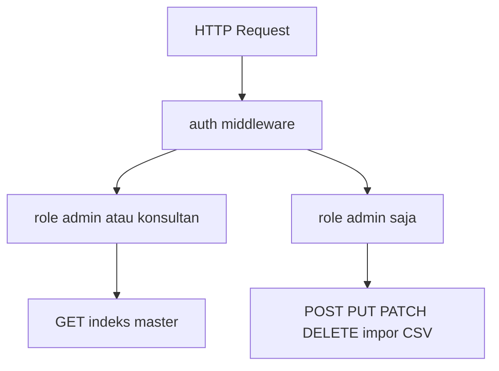

# Master data: akses baca semua peran, kelola admin + soft delete

## Konteks saat ini

- Rute master dan indeks ada di [`routes/web.php`](c:\laragon\www\aiassisstedconsultan\routes\web.php) dengan middleware `role:admin,konsultan`.
- [`MasterDataController`](c:\laragon\www\aiassisstedconsultan\app\Http\Controllers\MasterDataController.php) hanya mengembalikan view indeks + pagination; **belum ada** create/edit/hapus.
- Migrasi fondasi ([`2026_05_11_100000_create_ais_foundation_tables.php`](c:\laragon\www\aiassisstedconsultan\database\migrations\2026_05_11_100000_create_ais_foundation_tables.php)) **tidak** memakai soft delete; belum ada kolom `dihapus_pada` / `deleted_at`.

## Kebutuhan produk

| Aksi | admin | konsultan |
|------|-------|-----------|
| Lihat master (indeks + detail jika ada) | ya | ya |
| Tambah / ubah / hapus (soft delete) | ya | tidak |

Hapus = **soft delete** (baris tetap di DB, disembunyikan dari query normal).

Tambahan: **Impor peserta (CSV)** termasuk “penambahan” — pindahkan dari grup `admin,konsultan` ke **admin saja** (GET+POST [`ParticipantImportController`](c:\laragon\www\aiassisstedconsultan\app\Http\Controllers\ParticipantImportController.php)).

## 1. Basis data: kolom soft delete

Satu migrasi baru menambahkan `dihapus_pada` (nullable `timestamp`, indeks ringan) pada **7 tabel master**:

- `ais_kelompok_kompetensi`, `ais_kompetensi`, `ais_tingkat_kompetensi`, `ais_alat_penilaian`, `ais_versi_matriks`, `ais_pemetaan_kompetensi_alat`, `ais_peserta`

Mengikuti konvensi penamaan Indonesia proyek (setara Laravel `deleted_at`): di model set `const DELETED_AT = 'dihapus_pada';` dan pakai trait `Illuminate\Database\Eloquent\SoftDeletes`.

**Query indeks konsultan/admin (baca):** tetap pakai perilaku bawaan trait (otomatis `WHERE dihapus_pada IS NULL`). Tidak perlu `withTrashed` kecuali untuk fitur “tong sampah” (opsional; tidak wajib di MVP kecuali Anda ingin admin melihat yang terhapus).

**Relasi / aturan hapus:** untuk entitas bertingkat (mis. kelompok masih punya kompetensi yang belum dihapus), tambahkan **validasi di lapisan layanan atau FormRequest** sebelum soft delete (tolak dengan pesan jelas), agar tidak meninggalkan data “aneh” di UI. Untuk junction `ais_pemetaan_kompetensi_alat`, cukup soft delete baris pemetaan; FK ke entitas lain tetap valid karena baris induk masih ada.

## 2. Model

Pada model terkait ([`CompetencyGroup`](c:\laragon\www\aiassisstedconsultan\app\Models\CompetencyGroup.php), `Competency`, `CompetencyLevel`, `AssessmentTool`, `MatrixVersion`, `CompetencyToolMapping`, `Participant`):

- `use SoftDeletes;`
- `public const DELETED_AT = 'dihapus_pada';`

Pastikan **seluruh tempat yang membangun dropdown / logika bisnis** (mis. [`AssessmentController`](c:\laragon\www\aiassisstedconsultan\app\Http\Controllers\AssessmentController.php), preset alat, impor peserta) secara implisit memakai model tanpa baris terhapus (sudah default dengan SoftDeletes).

## 3. Otorisasi & rute

**Pola yang disarankan (jelas dan konsisten dengan [`EnsureUserHasRole`](c:\laragon\www\aiassisstedconsultan\app\Http\Middleware\EnsureUserHasRole.php)):**

- Grup luar: `auth` + `role:admin,konsultan` → semua **GET** indeks master yang sudah ada + (nanti) GET `create`/`edit` **hanya untuk admin** — lebih bersih memisahkan:
  - **Sub-grup A** (`role:admin,konsultan`): GET indeks master (tetap seperti sekarang).
  - **Sub-grup B** (`role:admin`): GET `create`/`edit`, semua POST/PUT/PATCH, DELETE (soft), dan **impor CSV peserta**.

Alternatif setara: Gate `manage-master-data` di [`AppServiceProvider`](c:\laragon\www\aiassisstedconsultan\app\Providers\AppServiceProvider.php) + `$this->authorize()` di controller; pilih satu pola agar tidak dobel.

## 4. Controller & validasi

- Pecah atau perluas struktur: **resource controller per entitas** di namespace `App\Http\Controllers\Master` (mis. `CompetencyGroupController`, `CompetencyController`, …) agar `store`/`update`/`destroy` terisolasi dan mudah diuji.
- [`MasterDataController`](c:\laragon\www\aiassisstedconsultan\app\Http\Controllers\MasterDataController.php) bisa tetap untuk “hub” [`master.index`](c:\laragon\www\aiassisstedconsultan\resources\views\master\index.blade.php) atau digabung; yang penting method indeks per entitas tetap bisa dipanggil konsultan.
- `FormRequest` per operasi (atau per entitas) untuk aturan unik (`kode`, FK wajib, dll.).

**Hapus:** panggil `$model->delete()` (soft). Opsional: tombol “pulihkan” nanti memakai `restore()` — tidak wajib di langkah pertama.

## 5. UI (Blade + sidebar)

- Pada setiap view indeks di [`resources/views/master/*.blade.php`](c:\laragon\www\aiassisstedconsultan\resources\views\master): jika `auth()->user()->role === 'admin'`, tampilkan tautan **Tambah**, **Ubah**, **Hapus** (form DELETE dengan `@csrf`).
- Form `create`/`edit` konsisten dengan layout [`layouts/app.blade.php`](c:\laragon\www\aiassisstedconsultan\resources\views\layouts\app.blade.php); notifikasi tetap lewat session + SweetAlert yang sudah ada.
- [`resources/views/layouts/app.blade.php`](c:\laragon\www\aiassisstedconsultan\resources\views\layouts\app.blade.php): submenu **Impor peserta** hanya untuk `admin` (konsultan tidak melihat), selaras dengan rute.

## 6. Cakupan CRUD per entitas (kompleksitas)

- **Kelompok kompetensi, alat penilaian:** form sederhana (kolom sesuai migrasi).
- **Kompetensi:** form + pilih kelompok (dropdown hanya non-trashed).
- **Tingkat kompetensi:** form + pilih kompetensi + `tingkat` unik per kompetensi.
- **Versi matriks:** form field sesuai model ([`MatrixVersion`](c:\laragon\www\aiassisstedconsultan\app\Models\MatrixVersion.php)).
- **Pemetaan kompetensi–alat:** form tiga FK + `wajib`, `bobot`, `aktif`.
- **Peserta:** form manual create/edit selain CSV; soft delete; impor CSV admin-only.

## 7. Pengujian & dokumentasi

- Feature test: konsultan **200** pada GET indeks master; konsultan **403** pada POST store (salah satu entitas cukup sebagai contoh).
- Feature test: admin boleh store + soft delete.
- Opsional: entri singkat di [`documentation/development_history.md`](c:\laragon\www\aiassisstedconsultan\documentation\development_history.md) jika Anda ingin jejak perubahan (sesuai kebiasaan proyek).

## Diagram alur otorisasi

## Risiko / catatan

- Volume kode cukup besar (7 entitas × form + request + rute); implementasi bisa dilakukan **bertahap** (mis. satu entitas lengkap sebagai pola, lalu menyalin) tanpa mengubah keputusan arsitektur di atas.
- Setelah migrasi, jalankan ulang seeder hanya jika perlu; kolom baru nullable tidak memecahkan data lama.
