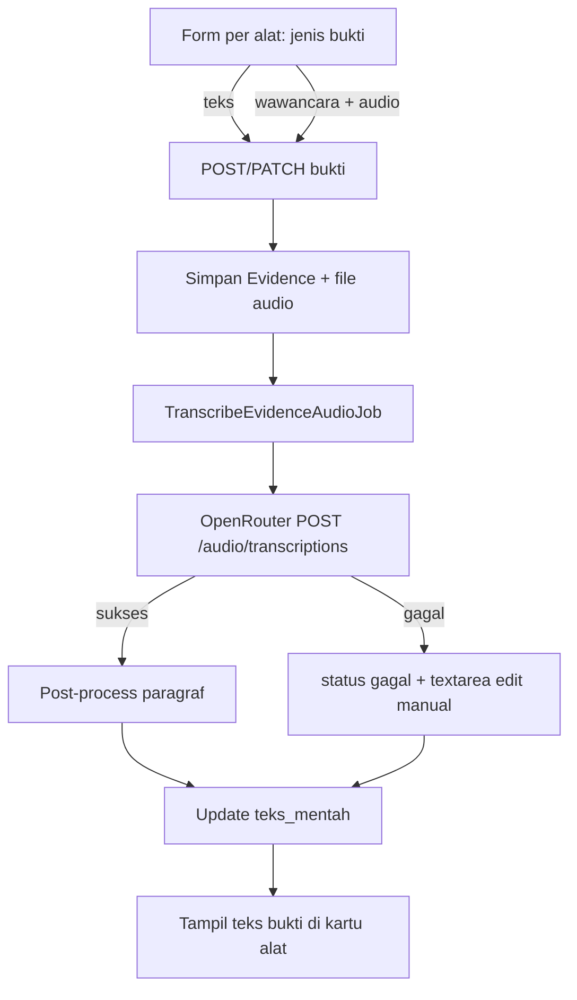

# Upload Bukti Teks/Wawancara + Update Bukti

## Konteks saat ini

- Bukti manual disimpan di [`app/Models/Evidence.php`](app/Models/Evidence.php) (`ais_bukti_penilaian`), hanya **create** via [`AssessmentController::storeEvidence`](app/Http/Controllers/AssessmentController.php) + textarea di [`resources/views/assessments/show.blade.php`](resources/views/assessments/show.blade.php) (Section F).
- **Tidak ada** update/delete bukti manual, **tidak ada** upload file, **tidak ada** STT.
- Proyek **sudah memakai OpenRouter** untuk analisis AI ([`OpenRouterClient`](app/Http/Controllers/AssessmentController.php), `OPENROUTER_API_KEY` di [`config/ai.php`](config/ai.php)).

## Mengapa tidak pakai Whisper lokal / plugin Laravel lokal?

| Opsi | Keterangan |
|------|------------|
| **Whisper lokal (binary/ffmpeg)** | Butuh install di server Laragon — user tidak yakin server mendukung |
| **Plugin PHP** (`codewithkyrian/whisper.php`, `b7s/whisper-php`) | Tetap wrapper **whisper.cpp** + ekstensi PHP FFI — masalah server sama |
| **`openai-php/laravel`** | Cloud Whisper API terpisah — butuh kunci OpenAI baru |
| **OpenRouter STT** (dipilih) | Endpoint `POST /api/v1/audio/transcriptions`, model `openai/whisper-large-v3` atau `whisper-large-v3-turbo`; **reuse API key OpenRouter yang sudah ada**; tidak perlu install di server |

Dokumentasi OpenRouter STT: [Speech-to-Text guide](https://openrouter.ai/docs/guides/overview/multimodal/stt)

## Arsitektur target



## 1. Skema database

Migrasi baru pada `ais_bukti_penilaian`:

| Kolom | Tipe | Keterangan |
|-------|------|------------|
| `jenis_sumber` | enum `teks`, `wawancara` | Default `teks` |
| `path_audio` | string nullable | Path relatif di disk `local` |
| `mime_audio` | string nullable | |
| `durasi_audio_detik` | unsigned int nullable | Dari response `usage.seconds` jika ada |
| `status_transkripsi` | enum `menunggu`, `memproses`, `selesai`, `gagal` | Null untuk bukti teks murni |
| `pesan_status_transkripsi` | text nullable | Error message |

Tambah enum PHP `EvidenceSourceType` di `app/Enums/`.

## 2. Konfigurasi STT (OpenRouter)

Extend [`config/ai.php`](config/ai.php) atau file baru [`config/stt.php`](config/stt.php) yang membaca kunci dari config OpenRouter yang sama:

```env
STT_AKTIF=true
STT_MODEL=nvidia/parakeet-tdt-0.6b-v3
STT_LANGUAGE=id
STT_SILENCE_GAP_DETIK=1.5
STT_MAX_FILE_MB=25
```

- `STT_AKTIF` default mengikuti `AI_AKTIF` / ketersediaan `OPENROUTER_API_KEY`
- Tidak perlu `WHISPER_BINARY_PATH` atau `FFMPEG_BINARY_PATH`

### Biaya model STT (OpenRouter, Mei 2026)

**Tidak ada model STT `:free`** di OpenRouter. Router `openrouter/free` hanya untuk model **teks/chat** (Gemini, Llama, Qwen, dll.), bukan transkripsi audio.

| Model | Perkiraan harga | Catatan |
|-------|-----------------|--------|
| `nvidia/parakeet-tdt-0.6b-v3` | ~$0.0015/menit | **Default rencana** — murah + **segment timestamp** (cocok untuk paragraf dari jeda) |
| `openai/whisper-large-v3` | ~$0.0015/menit | Akurat multibahasa |
| `openai/whisper-large-v3-turbo` | ~$0.04/jam | Sangat murah untuk audio panjang |
| `qwen/qwen3-asr-flash` | ~$0.000035/detik | Bagus untuk Bahasa Indonesia/dialek |

Wawancara 30 menit ≈ **$0.045** dengan Parakeet/Whisper V3 — bukan gratis, tapi biaya sangat kecil. Kredit percobaan kecil dari akun OpenRouter baru bisa dipakai untuk uji coba.

**Alternatif benar-benar gratis:** fallback **input transkrip manual** di textarea (sudah ada di rencana) bila kredit habis atau user tidak ingin bayar.

## 3. Service layer

### `App\Services\Stt\OpenRouterSttTranscriber` (implements `TranscriberContract`)

- Baca file audio dari storage → base64 encode
- Deteksi format dari ekstensi (`mp3`, `wav`, `m4a`, `webm`, dll.)
- `POST {url_dasar}/audio/transcriptions` dengan header Authorization sama seperti [`OpenRouterClient`](app/Services/Ai/OpenRouterClient.php)
- Body: `{ model, input_audio: { data, format }, language: "id" }`
- Response: `{ text, usage }` → simpan ke `teks_mentah`

**Paragraf dari jeda:**
- OpenRouter STT standar mengembalikan `text` utuh (tanpa segment di schema publik)
- Post-process praktis: pecah teks panjang menjadi paragraf dengan heuristik (kalimat baru setelah `.` / `?` / `!` + jeda panjang dalam teks jika ada `\n` dari model)
- Jika nanti OpenRouter/provider mengembalikan segment timestamp, upgrade ke logika gap `>= STT_SILENCE_GAP_DETIK`
- Asesor tetap bisa **edit transkrip** sebelum/sesudah simpan (fallback manual)

### `App\Services\Stt\EvidenceAudioStorage`

- Simpan upload ke `storage/app/evidence-audio/{id_asesmen}/{uuid}.{ext}`
- Hapus file lama saat re-upload

### Method baru di `OpenRouterClient` (atau client terpisah)

`transcribeAudio(string $pathFile, string $format): array{text, usage}` — agar reuse timeout, retry, logging.

## 4. Job async transkripsi

[`app/Jobs/TranscribeEvidenceAudioJob.php`](app/Jobs/TranscribeEvidenceAudioJob.php):

- Queue: `AI_QUEUE_CONNECTION` / queue `stt-transcription`
- Sukses: update `teks_mentah`, `status_transkripsi=selesai`, reset kolom `ai_*`
- Gagal: `status_transkripsi=gagal`, simpan pesan; **UI menampilkan textarea editable** agar asesor mengetik/menyalin transkrip manual; audio tetap tersimpan

## 5. Backend: store + update + guard finalisasi

### Routes baru di [`routes/web.php`](routes/web.php)

```
PATCH asesmen/{asesmen}/bukti/{bukti}  → asesmen.bukti.update
```

### Request classes

- Trait `ValidatesEvidenceForAssessment` untuk validasi bersama
- [`StoreEvidenceRequest`](app/Http/Requests/StoreEvidenceRequest.php):
  - `jenis_sumber` required `in:teks,wawancara`
  - `teks_mentah` required_if `jenis_sumber=teks`; juga boleh dikirim saat `wawancara` + `status_transkripsi=gagal` (simpan manual)
  - `berkas_audio` required_if `jenis_sumber=wawancara` (create); optional on update (re-upload)
  - Guard `asesmen.status !== SelesaiFinal`
- [`UpdateEvidenceRequest`](app/Http/Requests/UpdateEvidenceRequest.php): sama + pastikan `{bukti}` milik `{asesmen}`

### Controller [`AssessmentController`](app/Http/Controllers/AssessmentController.php)

- `storeEvidence`: teks langsung simpan; wawancara simpan audio + dispatch job
- `updateEvidence`: ubah teks manual, atau re-upload audio (re-transkripsi); reset `ai_*`; blokir jika final
- Kedua method diblokir jika `SelesaiFinal`

## 6. UI — tab Pengumpulan Bukti

Partial baru [`resources/views/assessments/partials/evidence-manual-per-alat.blade.php`](resources/views/assessments/partials/evidence-manual-per-alat.blade.php)

**Per kartu alat:**

- Toggle **Bukti Teks** | **Bukti Wawancara**
- Wawancara: file input `accept="audio/*"`, hint format MP3/WAV/M4A/WebM
- Badge status: `Menunggu transkripsi` / `Memproses` / `Selesai` / `Gagal — edit manual`
- Jika transkripsi gagal atau selesai: **textarea editable** untuk koreksi transkrip sebelum simpan final
- Tombol **Perbarui bukti** per baris bukti (hanya saat draft)
- Empty state `.asesmen-evidence-empty` — vertikal di tengah
- Form disembunyikan saat `$isFinal`

JS di [`resources/js/app.js`](resources/js/app.js): toggle field teks/audio; tampilkan textarea fallback saat status gagal.

## 7. Perilaku bisnis

| Kondisi | Perilaku |
|---------|----------|
| Draft | Create + update bukti |
| Final | Form hidden; POST/PATCH ditolak |
| STT sukses | Teks otomatis terisi; asesor boleh edit lalu simpan |
| STT gagal | Audio tersimpan; asesor isi/koreksi transkrip manual di textarea |
| Update teks/audio | Reset `ai_*` |

## 8. Testing

[`tests/Feature/EvidenceUploadAndUpdateTest.php`](tests/Feature/EvidenceUploadAndUpdateTest.php):

- Store bukti teks
- Store wawancara + mock `TranscriberContract` → teks terisi
- STT gagal → status `gagal` + update manual teks berhasil
- Update ditolak saat final
- Store ditolak saat metode `payload_alat`

## 9. Urutan implementasi

1. Migrasi + enum
2. `OpenRouterSttTranscriber` + job + config
3. Store/update + guard final
4. Partial UI + fallback manual + CSS
5. Tests + dokumentasi `.env` STT di `petunjuk_dev.MD`

## Prasyarat (user)

- `OPENROUTER_API_KEY` sudah terisi (sama dengan fitur AI)
- Akun OpenRouter punya kredit untuk model STT (Whisper di-bill per detik audio)
- Queue worker jika tidak `sync` (opsional; `sync` OK untuk dev)

**Tidak perlu:** install Whisper, ffmpeg, atau plugin PHP FFI di Laragon.
