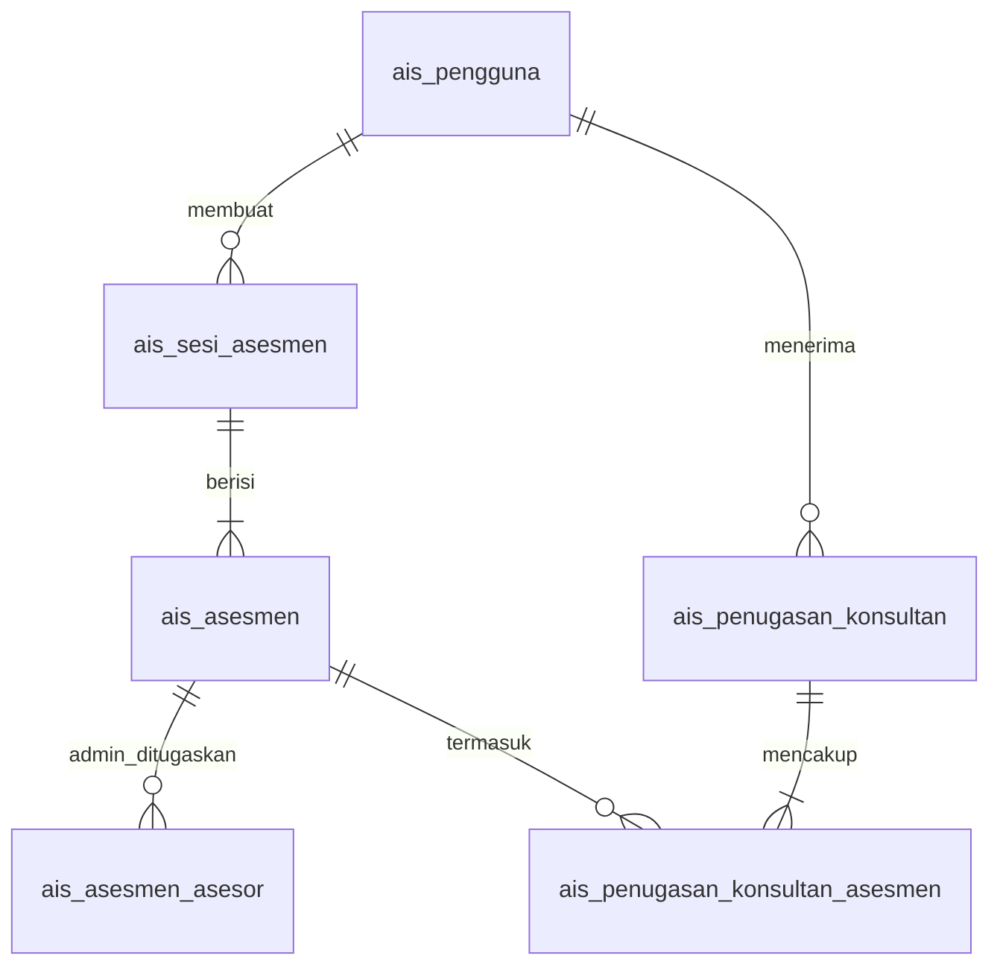
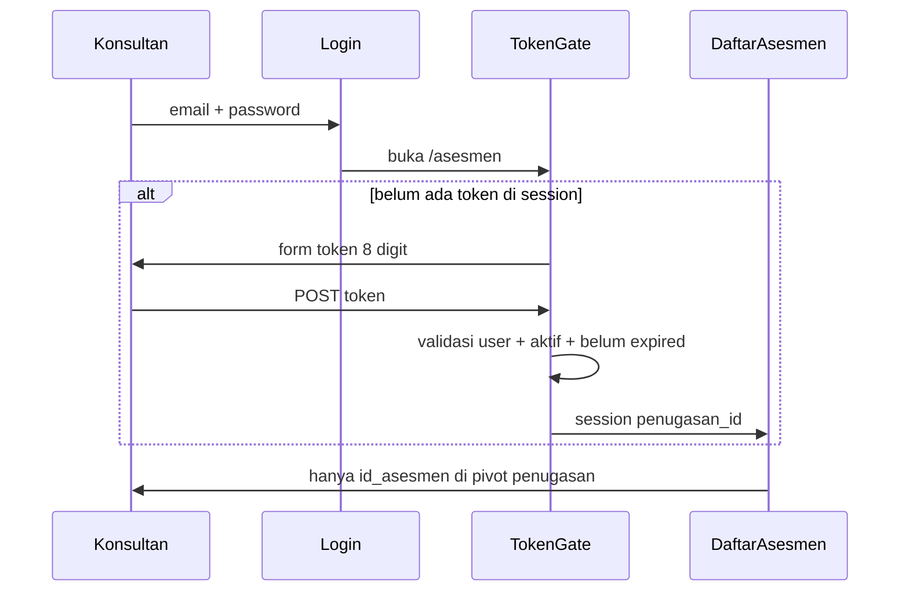

# Rencana: Master User, Sesi Assessment, Penugasan Admin & Token Konsultan

## Konteks codebase saat ini

| Area | Kondisi |
|------|---------|
| Pengguna | [`app/Models/User.php`](app/Models/User.php) → `ais_pengguna` (`peran`: `admin` \| `konsultan`); **belum ada** CRUD admin di UI |
| Asesmen | [`ais_asesmen`](database/migrations/2026_05_13_120000_create_ais_assessment_core_tables.php) mandiri; **tanpa** parent sesi bisnis |
| Asesor | [`ais_asesmen_asesor`](database/migrations/2026_05_13_120000_create_ais_assessment_core_tables.php) — checkbox admin+konsultan saat buat asesmen; **belum** membedakan peran penugasan |
| Policy | [`AssessmentPolicy`](app/Policies/AssessmentPolicy.php) — semua admin/konsultan boleh lihat & ubah **semua** asesmen |
| Sesi HTTP | `ais_sesi` di migrasi `0001_...` = **Laravel session**, bukan sesi assessment center |

**Keputusan dari Anda:** asesmen baru **wajib** punya sesi; konsultan **login biasa**, lalu **wajib memasukkan token 8 karakter** sebelum daftar asesmen menampilkan hanya yang diassign untuk token itu.

---

## Arsitektur data (baru)

### 1. Tabel `ais_sesi_asesmen` (sesi bisnis — nama berbeda dari `ais_sesi`)

| Kolom | Catatan |
|-------|---------|
| `kode_sesi`, `nama`, `tanggal_mulai`, `tanggal_selesai` (nullable) | Identitas sesi AC |
| `status` | `draf` \| `aktif` \| `selesai` |
| `catatan` | opsional |
| `id_pengguna_pembuat` | FK admin |

### 2. Ubah `ais_asesmen`

- Tambah `id_sesi_asesmen` FK **NOT NULL** (setelah migrasi data: sesi default `LEGACY` untuk baris lama).
- Alur **Buat asesmen** hanya dari dalam sesi (`/sesi/{sesi}/asesmen/buat`) atau form wajib pilih sesi.

### 3. Perketat `ais_asesmen_asesor` (admin penilai)

- Tambah kolom `jenis_penugasan` = `admin` (default untuk baris existing).
- Hanya user `peran=admin` yang boleh masuk ke sini.
- **Hapus** konsultan dari checkbox asesor di form buat asesmen (penugasan konsultan lewat bundle token).

### 4. Penugasan konsultan + token

**Tabel `ais_penugasan_konsultan`** (satu “paket” akses):

| Kolom | Catatan |
|-------|---------|
| `id_pengguna` | konsultan |
| `id_sesi_asesmen` | opsional tapi disarankan wajib di UI |
| `token_akses` | **8 karakter** `[A-Z0-9]`, **unique**, index |
| `aktif`, `kedaluwarsa_pada` (nullable) | admin bisa nonaktifkan |
| `id_pengguna_pembuat` | admin yang generate |

**Pivot `ais_penugasan_konsultan_asesmen`**: `id_penugasan` + `id_asesmen` (asesmen harus dalam sesi yang sama bila `id_sesi_asesmen` diisi).

**Generator token:** `Str::upper(Str::random(8))` dengan retry jika bentrok; tampilkan sekali saat dibuat/regenerate (SweetAlert + copy).

### 5. Master pengguna

- Tambah `aktif` boolean di `ais_pengguna` (default true).
- CRUD admin-only mengikuti pola [`ParticipantMasterController`](app/Http/Controllers/Master/ParticipantMasterController.php):
  - Index / create / edit / soft-nonaktif (atau toggle `aktif`).
  - Field: nama, alamat_surel, peran (`admin` \| `konsultan`), kata sandi (wajib saat create, opsional saat edit).
  - Validasi: tidak hapus diri sendiri; tidak turunkan peran admin terakhir.

---

## Alur otorisasi

### Policy & middleware (inti)

| Peran | `viewAny` / index asesmen | `view` / `update` asesmen |
|-------|---------------------------|---------------------------|
| **Admin** | Semua asesmen (filter per sesi opsional di UI) | **Hanya** jika ada di `ais_asesmen_asesor` dengan `jenis_penugasan=admin`, **atau** super-admin flag (opsi: semua admin organisasi boleh override — default: **hanya yang ditugaskan**) |
| **Konsultan** | Setelah token gate; query terfilter `penugasan_id` dari session | Hanya asesmen dalam pivot penugasan token aktif |

**Middleware baru:** `EnsureKonsultanPenugasanToken` pada grup route `asesmen/*` untuk `role:konsultan`.

**Session key:** `penugasan_konsultan_id` (+ opsional `token_masuk_pada`).

**Logout / ganti token:** tombol “Ganti token” menghapus session gate.

### Admin — sesi & penugasan

| Fitur | Route (contoh) | Akses |
|-------|----------------|-------|
| Daftar / buat / edit sesi | `sesi-asesmen.*` | `role:admin` |
| Detail sesi: daftar asesmen, tombol buat asesmen | `sesi-asesmen.show` | admin |
| Kelola penugasan admin per asesmen | di detail asesmen atau sesi | admin |
| Buat penugasan konsultan + token + centang asesmen | `sesi-asesmen/{sesi}/penugasan-konsultan` | admin |
| Regenerate / nonaktifkan token | PATCH pada penugasan | admin |

---

## Perubahan UI (ringkas)

1. **Master data hub** [`resources/views/master/index.blade.php`](resources/views/master/index.blade.php): tautan **Pengguna**.
2. **Navigasi admin:** menu **Sesi assessment** (sebelum atau menggantikan akses langsung “Buat asesmen” global).
3. **Konsultan:** setelah login, menu Asesmen → halaman [`resources/views/assessments/token-gate.blade.php`](resources/views/assessments/token-gate.blade.php) jika session gate kosong.
4. **Form buat asesmen:** pindah konteks ke sesi; penugasan admin (multi-select admin saja); hapus konsultan dari checkbox lama.
5. **Detail sesi:** tabel asesmen + panel “Penugasan konsultan” (token, daftar asesmen, regenerate).

---

## File utama yang akan ditambah/diubah

| Layer | File |
|-------|------|
| Migrasi | `create_ais_sesi_asesmen_tables.php`, `add_id_sesi_to_ais_asesmen.php`, `add_aktif_to_ais_pengguna.php`, `create_ais_penugasan_konsultan_tables.php`, alter `ais_asesmen_asesor` |
| Model | `AssessmentSession`, `ConsultantAssignment`, `ConsultantAssignmentAssessment` |
| Enum | `AssessmentSessionStatus`, `AssessorAssignmentType` |
| Service | `ConsultantAccessTokenGenerator`, `ConsultantAssignmentService` |
| Middleware | `EnsureKonsultanPenugasanToken` |
| Policy | `AssessmentPolicy`, `AssessmentSessionPolicy`, `UserPolicy` |
| Controller | `Master\UserMasterController`, `AssessmentSessionController`, `ConsultantAssignmentController`, `AssessmentTokenGateController` |
| Request | `Master/StoreUserRequest`, `StoreAssessmentSessionRequest`, `StoreConsultantAssignmentRequest`, `VerifyConsultantTokenRequest` |
| Routes | [`routes/web.php`](routes/web.php) — pisahkan grup admin / konsultan |
| Views | `master/users/*`, `assessment-sessions/*`, `assessments/token-gate.blade.php` |
| Seeder | Sesi `LEGACY` + assign asesmen existing; update [`DatabaseSeeder`](database/seeders/DatabaseSeeder.php) |
| Tests | Feature: user CRUD admin-only, sesi wajib, policy admin ditugaskan, konsultan token gate + filter |

---

## Migrasi data existing

1. Buat sesi default `KAMUS-LEGACY` / `SES-LEGACY`.
2. `UPDATE ais_asesmen SET id_sesi_asesmen = ...`.
3. Migrasi `ais_asesmen_asesor` existing → `jenis_penugasan = admin` (konsultan yang ada di tabel dihapus atau dipindah manual ke penugasan baru — dokumentasikan di catatan deploy).

---

## Dokumentasi

Perbarui [`documentation/petunjuk_dev.MD`](documentation/petunjuk_dev.MD) dan [`documentation/development_history.md`](documentation/development_history.md): bedakan `ais_sesi` (HTTP) vs `ais_sesi_asesmen` (bisnis), alur token konsultan, aturan penugasan admin.

---

## Risiko & mitigasi

| Risiko | Mitigasi |
|--------|----------|
| Token 8 char brute-force | throttle route verifikasi (mis. 5/menit), log gagal, opsional lock sementara |
| Admin tidak ditugaskan tidak bisa menilai | UI jelas di sesi; admin super bisa assign diri sendiri |
| Breaking URL buat asesmen | Redirect `asesmen/buat` → pilih sesi atau 404 dengan pesan |

---

## Urutan implementasi disarankan

1. Migrasi + model sesi + FK asesmen + seeder legacy  
2. Master user CRUD + `aktif`  
3. `AssessmentSessionController` + UI sesi  
4. Perketat `ais_asesmen_asesor` + policy admin ditugaskan  
5. Penugasan konsultan + token + middleware gate + filter index  
6. Sesuaikan buat asesmen, dashboard filter, tests  
7. Dokumentasi
