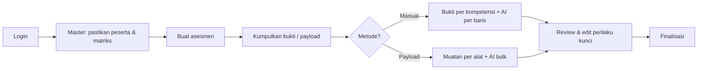

# Petunjuk Pengembangan & Penggunaan — AIS LPP 2026

Dokumen ini menjelaskan cara menyiapkan lingkungan, alur penggunaan aplikasi, serta rincian fitur yang tersedia pada **AI Assessment Support (AIS)** — sistem pendukung asesmen kompetensi berbasis web (Laravel 12).

---

## 1. Ringkasan Aplikasi

AIS mendukung siklus **asesmen kompetensi** untuk assessment center:

- **Master data** kamus kompetensi (kelompok, kompetensi, tingkat/indikator, alat penilaian, versi matriks, peserta).
- **Pemetaan kompetensi–alat** per versi matriks (“kamus”).
- **Asesmen** per peserta dengan preset alat sesuai tujuan (Promosi / Pemetaan talenta) dan opsi tanpa INTRAY (mis. BOD-3).
- **Pengumpulan bukti** manual per kompetensi atau otomatis lewat payload alat.
- **Perilaku kunci (KB)** yang dapat diisi manual atau diusulkan AI (OpenRouter).
- **Finalisasi** asesmen setelah cakupan kompetensi wajib terpenuhi.
- **Audit**: log aktivitas admin dan log pemanggilan AI.

Keputusan penilaian akhir tetap pada **asesor**; hasil AI wajib direview dan dapat diedit.

---

## 2. Persyaratan Teknis

| Komponen | Versi / catatan |
|----------|-----------------|
| PHP | ^8.2 |
| Composer | Terbaru |
| Node.js & npm | Untuk Vite (Tailwind CSS 4, Quill, SweetAlert2) |
| Database | SQLite (default dev) atau MySQL/MariaDB |
| Queue worker | Wajib untuk analisis AI async (`php artisan queue:listen`) |
| API AI | Akun OpenRouter + kunci API (opsional di dev tanpa AI) |

---

## 3. Instalasi & Menjalankan Aplikasi

### 3.1 Setup awal

```bash
cd c:\laragon\www\ais_lpp2026
composer install
cp .env.example .env
php artisan key:generate
```

Atur koneksi database di `.env` (contoh SQLite: `DB_CONNECTION=sqlite` dan pastikan file `database/database.sqlite` ada).

```bash
php artisan migrate
php artisan db:seed
npm install
npm run build
```

### 3.2 Menjalankan server pengembangan

**Opsi A — satu perintah (disarankan):**

```bash
composer run dev
```

Menjalankan bersamaan: `php artisan serve`, `queue:listen`, `pail` (log), dan `npm run dev` (Vite).

**Opsi B — manual:**

```bash
php artisan serve
php artisan queue:listen --tries=1
npm run dev
```

Buka aplikasi di URL yang ditampilkan (biasanya `http://127.0.0.1:8000`).

### 3.3 Akun demo (setelah `db:seed`)

| Peran | Email | Kata sandi default |
|-------|-------|-------------------|
| Admin | `admin@example.com` | `password` |
| Konsultan | `konsultan@example.com` | `password` |

Peserta contoh: kode `DEMO-001`, matriks `KAMUS-17-DEFAULT`. Seeder juga membuat data asesmen contoh (manual + payload) lewat `ContohAssessmentSeeder`.

> **Keamanan:** Ganti kata sandi sebelum production. Jangan commit file `.env`.

### 3.4 Perintah berguna

| Perintah | Fungsi |
|----------|--------|
| `php artisan migrate` | Terapkan migrasi |
| `php artisan db:seed` | Isi master + contoh |
| `php artisan test` | Jalankan PHPUnit |
| `./vendor/bin/pint` | Format kode PHP |
| `npm run build` | Build aset produksi |

**Migrasi destruktif:** Perintah `migrate:fresh`, `migrate:refresh`, `db:wipe` diblokir kecuali `ALLOW_MIGRATE_FRESH=true` di `.env` (mencegah penghapusan data tidak sengaja).

---

## 4. Peran Pengguna (RBAC)

| Peran | Kode | Hak akses utama |
|-------|------|-----------------|
| **Admin** | `admin` | Semua fitur konsultan + CRUD master data, impor CSV peserta, log aktivitas, log AI, batalkan finalisasi asesmen |
| **Konsultan** | `konsultan` | Lihat master data, buat/kelola asesmen, bukti, perilaku kunci, analisis AI |

Middleware `role:admin` / `role:admin,konsultan` mengatur route di `routes/web.php`.

---

## 5. Navigasi & Alur Penggunaan

Setelah login, menu samping menampilkan:

1. **Dasbor** — ringkasan sesi (fitur analitik GAP/Job Fit masih dalam rencana fase berikutnya).
2. **Asesmen** — daftar, buat, dan detail asesmen.
3. **Master data** (submenu):
   - Ringkasan master
   - Kelompok kompetensi
   - Kompetensi
   - Tingkat kompetensi
   - Alat penilaian
   - Versi matriks (+ pemetaan per versi)
   - Peserta
   - *(Admin)* Log aktivitas, Log AI, Impor peserta CSV

### 5.1 Alur kerja tipikal assessor



---

## 6. Detail Fitur

### 6.1 Autentikasi

- Login email + kata sandi (`/login`).
- Logout via tombol di sidebar.
- Tabel pengguna: `ais_pengguna` (kolom domain berbahasa Indonesia: `nama`, `alamat_surel`, `kata_sandi`, `peran`).
- Laravel Sanctum tersedia untuk token API (`ais_token_akses_pribadi`) — integrasi API dapat dikembangkan lebih lanjut.

### 6.2 Master data

#### Kelompok kompetensi (`ais_kelompok_kompetensi`)

Tiga kelompok standar seed: **INT** (Inti), **MNJ** (Manajerial), **LDR** (Kepemimpinan).

- **Admin:** tambah, ubah, hapus (soft delete).
- **Konsultan:** hanya lihat.

#### Kompetensi (`ais_kompetensi`)

17 kompetensi kamus PTPN (kode INF, RSL, ACH, … MED). Setiap kompetensi terhubung ke kelompok, memiliki definisi, `tingkat_maksimum` (6), flag `aktif`.

#### Tingkat kompetensi (`ais_tingkat_kompetensi`)

Indikator perilaku per level 1–6 per kompetensi. Seed menyertakan indikator lengkap untuk 15 kompetensi; **BCR** dan **BSV** mendapat placeholder level 1–6 jika belum ada definisi resmi.

#### Alat penilaian (`ais_alat_penilaian`)

| Kode | Nama |
|------|------|
| BEI | Behavioral Event Interview |
| LGD | Leaderless Group Discussion |
| PA | Presentation Analysis |
| INT | Interview |
| INTRAY | In-Tray Exercise |
| RP | Role Play |
| CASE | Case Analysis |
| RA | Rencana Aksi |
| MI | Managerial Inventory |

#### Versi matriks (`ais_versi_matriks`)

Representasi **“kamus”** kompetensi per klien/konteks (mis. `KAMUS-17-DEFAULT` untuk 17 kompetensi PTPN). Field penting: `kode_versi`, `nama_versi`, `kunci_kamus`, `catatan_konteks`, `aktif`, `bawaan`, `dipublikasikan_pada`.

**Pemetaan kompetensi–alat** (`ais_pemetaan_kompetensi_alat`):

- Diakses dari **Versi matriks → Pemetaan**.
- Kisi centang kompetensi × alat dengan atribut `wajib`, `bobot`, `aktif`.
- Admin dapat **sinkron** grid sekaligus.

#### Peserta (`ais_peserta`)

Data peserta asesmen: kode, nama, email, jabatan, pendidikan, tanggal lahir, versi matriks default.

**Impor CSV (admin):**

- Menu: Master data → Impor peserta (CSV).
- Unduh template (pemisah koma atau titik koma, UTF-8 + BOM).
- Kolom wajib: `kode_peserta`, `nama_lengkap`.
- Kolom opsional: `alamat_surel`, `jabatan`, `pendidikan`, `tanggal_lahir`, `kode_versi_matriks`.

### 6.3 Asesmen

#### Membuat asesmen (`/asesmen/buat`)

Form meminta:

| Field | Keterangan |
|-------|------------|
| Peserta | Peserta aktif |
| Versi matriks | Kamus yang mengunci set kompetensi & pemetaan alat |
| Tujuan | `promosi` atau `pemetaan_talenta` |
| Metode koleksi bukti | `manual` atau `payload_alat` (dapat diubah di detail) |
| Tanpa INTRAY | Centang untuk skenario BOD-3 |
| Asesor | Opsional; multi-pilih admin/konsultan |

**Preset alat otomatis** (`AlatAsesmenPreset`):

| Tujuan | Alat (kode) |
|--------|-------------|
| Promosi | PA, INTRAY, LGD, RA, MI, BEI |
| Pemetaan talenta | PA, INTRAY, LGD, MI, BEI (tanpa RA) |

Jika **Tanpa INTRAY** dicentang, kode `INTRAY` dihilangkan dari preset.

Status awal: **draf**. Alat yang dipilih mengacu pada master aktif dan flag `wajib` dari pemetaan matriks.

#### Status asesmen

| Status | Arti |
|--------|------|
| `draf` | Masih dapat diedit |
| `berlangsung` | *(reserved)* |
| `terintegrasi` | *(reserved — integrasi skor)* |
| `selesai_final` | Difinalisasi; input terkunci kecuali admin batalkan finalisasi |

#### Metode koleksi bukti

**A. Manual (`manual`)**

- Tambah **bukti penilaian** per kombinasi alat + kompetensi.
- Editor mendukung teks kaya (Quill); disimpan juga versi `teks_mentah`, `teks_mentah_rich`, `teks_mentah_normalized`.
- Tombol **Analisis AI** per baris bukti → usulan tingkat, kutipan verbatim, alasan konfirmatori → membuat/memperbarui **perilaku kunci** terkait.

**B. Otomatis — payload alat (`payload_alat`)**

- Unggah **teks muatan** per alat (satu payload per alat, dapat banyak entri).
- Tombol **Analisis AI bulk** pada payload → AI memetakan ke banyak kompetensi sekaligus dan membuat entri perilaku kunci (wajib direview asesor).

Metode dapat diubah di halaman detail asesmen selama belum final.

#### Perilaku kunci (`ais_perilaku_kunci`)

- Dapat ditambah manual atau dari hasil AI.
- Field: alat, kompetensi, bukti terkait (opsional), tingkat kompetensi, teks perilaku, alasan pemilihan, **kutipan referensi** (jangkar ke teks mentah).
- Edit form terpisah untuk koreksi pasca-AI.

#### Finalisasi

- Tombol finalisasi memeriksa **cakupan kompetensi wajib**: setiap kompetensi yang wajib di matriks (via pemetaan alat aktif) harus punya minimal satu perilaku kunci dengan `id_tingkat_kompetensi` terisi.
- Hanya **admin** yang dapat **membatalkan finalisasi** (kembali ke draf).

### 6.4 Fitur AI (OpenRouter)

**Aktivasi:**

- Isi `OPENROUTER_API_KEY` (atau `AI_OPENROUTER_API_KEY`) di `.env`.
- Opsional: `AI_AKTIF=false` untuk memaksa mati meski kunci ada.
- Tanpa `AI_AKTIF` eksplisit: aktif otomatis jika kunci terisi.

**Konfigurasi utama** (`config/ai.php`):

| Variabel | Default / fungsi |
|----------|------------------|
| `OPENROUTER_MODEL` | `google/gemini-2.0-flash-001` |
| `OPENROUTER_TIMEOUT` | 90 detik |
| `OPENROUTER_TEMPERATURE` | 0.2 |
| `AI_QUEUE_CONNECTION` | `database` |
| `AI_QUEUE_NAME` | `ai-analysis` |
| `AI_TRIGGER_PER_MINUTE` | 20 (throttle trigger UI) |

**Prinsip governance AI:**

- Prompt memaksa **kutipan verbatim** dari teks mentah; tidak mengarang fakta di luar bukti.
- Field konfirmatori menjelaskan kaitan kutipan dengan indikator level.
- Semua pemanggilan dicatat di `ais_log_ai` (admin dapat audit di **Log AI**).

**Job antrian:** `AnalyzeEvidenceAiJob`, `AnalyzeToolPayloadAiJob` — pastikan worker queue berjalan.

### 6.5 Log & audit

| Fitur | Akses | Isi |
|-------|-------|-----|
| **Log aktivitas** | Admin | Aksi penting (asesmen dibuat, AI dijalankan, finalisasi, perubahan master, dll.) |
| **Log AI** | Admin | Request/response ringkas, model, status, referensi entitas |

### 6.6 Soft delete

Master data utama mendukung **soft delete** (`dihapus_pada`). Data terhapus tidak muncul di daftar default tetapi tetap di database.

---

## 7. Konfigurasi Lingkungan (`.env`)

Selain database dan `APP_URL`, perhatikan:

```env
QUEUE_CONNECTION=database
SESSION_DRIVER=database

# AI
OPENROUTER_API_KEY=sk-or-...
OPENROUTER_MODEL=google/gemini-2.0-flash-001
AI_QUEUE_CONNECTION=database
AI_QUEUE_NAME=ai-analysis

# Keamanan migrasi
ALLOW_MIGRATE_FRESH=false
```

Untuk production: `APP_ENV=production`, `APP_DEBUG=false`, HTTPS, backup database, dan rotasi kunci API.

---

## 8. Struktur Data & Konvensi

- Prefix tabel domain: **`ais_`**.
- Nama tabel domain berbahasa Indonesia (`ais_kompetensi`, `ais_asesmen`, dll.).
- Kode kompetensi kelompok **INT** ≠ kode alat **INT** (domain berbeda).
- Versi matriks = “kamus” yang menentukan subset kompetensi dan pemetaan alat per klien.

### Seeder

| Seeder | Fungsi |
|--------|--------|
| `MasterDataSeeder` | Kelompok, 17 kompetensi, indikator, 9 alat, matriks default, pemetaan BEI/PA, peserta demo |
| `ContohVersiMatriksPaketSeeder` | Paket matriks tambahan (jika ada di repo) |
| `ContohAssessmentSeeder` | Asesmen contoh untuk UI |
| `DatabaseSeeder` | Mengorkestrasi semua + user admin & konsultan |

---

## 9. Pengujian

```bash
php artisan test
```

Suite mencakup antara lain: RBAC master data, mode koleksi bukti, analisis AI, antrian AI, preset alat asesmen.

---

## 10. Fitur dalam Rencana (belum / sebagian tersedia)

Berdasarkan rencana pengembangan MVP, berikut **belum** atau **baru sebagian** di UI:

| Area | Status |
|------|--------|
| Dasbor GAP & Job Fit | Belum |
| Mesin integrasi skor berbobot | Belum |
| Laporan naratif + export PDF | Belum |
| Wizard assessment lengkap (job target, snapshot matriks dinamis) | Sebagian (form buat asesmen sudah ada) |
| API eksternal dokumentasi publik | Sanctum ada; endpoint bisnis terbatas |

Gunakan dokumen rencana internal (`.cursor/plans/`) untuk detail fase berikutnya.

---

## 11. Pemecahan Masalah

| Gejala | Solusi |
|--------|--------|
| Tombol AI tidak muncul | Pastikan kunci OpenRouter terisi dan `AI_AKTIF` tidak `false` |
| Analisis AI menggantung | Jalankan `php artisan queue:listen`; cek `failed_jobs` |
| `429` saat trigger AI | Tunggu (throttle `AI_TRIGGER_PER_MINUTE`) |
| Finalisasi ditolak | Lengkapi perilaku kunci + tingkat untuk semua kompetensi wajib di ringkasan |
| `migrate:fresh` ditolak | Set sementara `ALLOW_MIGRATE_FRESH=true` hanya di dev |
| Aset CSS/JS kosong | `npm run dev` atau `npm run build` |

---

## 12. Referensi Kode

| Area | Lokasi |
|------|--------|
| Route web | `routes/web.php` |
| Controller asesmen | `app/Http/Controllers/AssessmentController.php` |
| Preset alat | `app/Services/Assessment/AlatAsesmenPreset.php` |
| AI bukti / bulk | `app/Services/Ai/EvidenceAiAnalyzer.php`, `BulkToolPayloadAiAnalyzer.php` |
| Konfigurasi AI | `config/ai.php` |
| Seed master | `database/seeders/MasterDataSeeder.php` |
| Data seed array | `database/seeders/data/master_seed_arrays.php` |

---

*Terakhir diselaraskan dengan codebase AIS LPP 2026 — Laravel 12, PHP 8.2+.*
