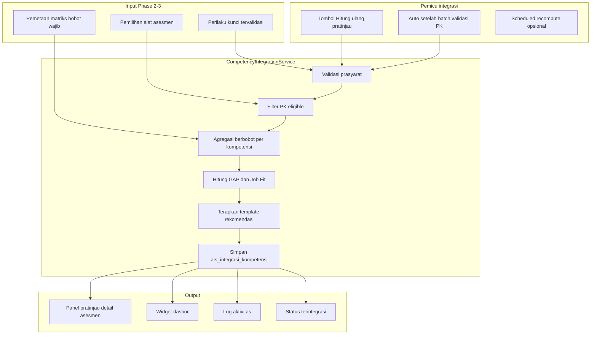
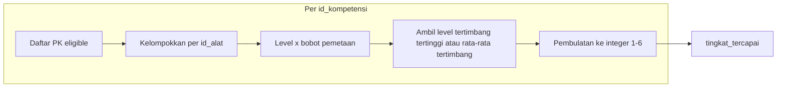
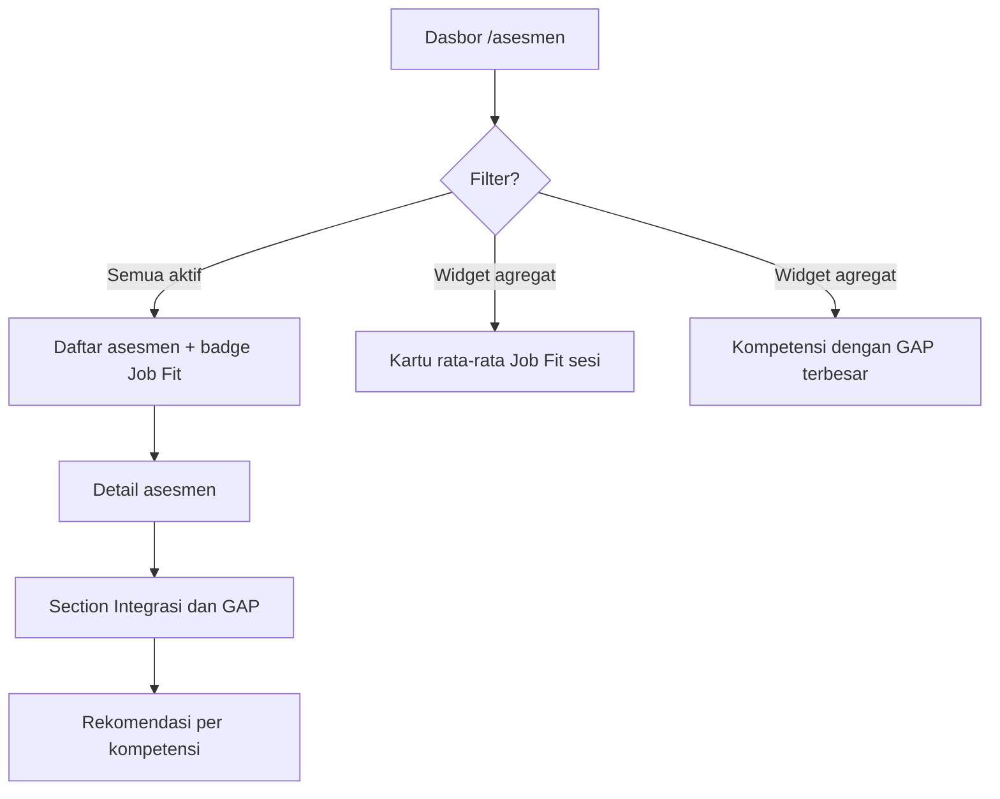

# Rancangan Flow & Checklist Phase 4 — Integration Engine

Dokumen ini menjadi acuan implementasi dan sign-off **Phase 4: Mesin integrasi skor berbobot, pratinjau GAP, Job Fit %, dan dashboard**. Selaras dengan [firstbuild.md](firstbuild.md), [ai_assessment_mvp_plan](.cursor/plans/ai_assessment_mvp_plan_d91a03dd.plan.md), dan [phase3_gate_checklist.md](phase3_gate_checklist.md).

---

## 0. Prasyarat

| # | Prasyarat | Status saat penulisan |
|---|-----------|------------------------|
| P1 | Phase 3 gate checklist (A–D) **PASS** | Lihat `phase3_gate_checklist.md` / `phase3_uat_signoff.md` |
| P2 | Perilaku kunci (`ais_perilaku_kunci`) dapat dibuat manual atau dari AI dan **direview asesor** | Ada |
| P3 | Pemetaan kompetensi–alat per versi matriks memiliki `wajib` dan `bobot` | Ada (`ais_pemetaan_kompetensi_alat`) |
| P4 | Pemilihan alat asesmen tersimpan per asesmen (`ais_pemilihan_alat_asesmen`) | Ada |
| P5 | Status asesmen mendukung nilai `terintegrasi` (enum sudah ada; alur belum) | **Ada** (setelah hitung pratinjau sukses) |

---

## 0.1 Aturan PK, pratinjau integrasi, dan finalisasi (resmi — diimplementasi)

Tiga lapisan dipisahkan secara eksplisit:

| Lapisan | Arti | «Final»? |
|---------|------|----------|
| **Perilaku kunci (PK)** | Keputusan mapping kompetensi × level | **Disahkan** = `tervalidasi = true` (UI: «Disimpan» / mapping resmi) |
| **Pratinjau integrasi** | GAP, Job Fit %, rekomendasi per kompetensi di `ais_integrasi_kompetensi` | **Bukan** nilai final HR; boleh dihitung ulang |
| **Finalisasi asesmen** | Kunci alur input (`selesai_final`) | Final proses asesmen, **bukan** persetujuan angka GAP |

### Syarat PK yang sama untuk pratinjau dan finalisasi

Untuk setiap **kompetensi wajib** (pemetaan `wajib=true` pada matriks versi asesmen, alat aktif di preset):

> Minimal **satu** PK dengan `tervalidasi = true`, `id_tingkat_kompetensi` terisi, alat terpilih, dan pasangan (kompetensi, alat) aktif di pemetaan.

Implementasi: `App\Support\MandatoryCompetencyCoverage`.

### Cara men-disahkan PK

| Jalur | Perilaku |
|-------|----------|
| **Tambah manual** | Otomatis `tervalidasi = true` (dianggap sudah direview asesor) |
| **AI bulk** | `tervalidasi = false` (Draft) sampai edit + centang «Simpan sebagai mapping resmi peserta» |
| **AI inkremental** | Tidak membuat PK; asesor buat PK manual atau dari bulk, lalu disahkan |

### Finalisasi vs pratinjau

- **Finalisasi** memerlukan cakupan PK disahkan (aturan di atas). **Tidak** mewajibkan pratinjau sudah dihitung (opsional operasional).
- **Hitung ulang pratinjau** ditolak jika status `selesai_final`.
- Angka Job Fit / GAP pada layar selalu berlabel **«Pratinjau»** / **«Bukan nilai final»**.

---

## 1. Tujuan & Deliverables Phase 4

### 1.1 Tujuan bisnis

- Mengagregasi bukti yang sudah disahkan asesor menjadi **skor pratinjau per kompetensi** (bukan keputusan final).
- Menghitung **GAP** (target vs capaian) dan **Job Fit %** untuk mendukung diskusi assessment center.
- Menyediakan **rekomendasi pratinjau** (Fit / Development / Not Fit) memakai template kamus (RCL/roles) bila data master tersedia.
- Memperbarui **dashboard** dan **detail asesmen** dengan panel integrasi yang jelas membedakan *pratinjau* vs *final*.

### 1.2 Deliverables teknis

| # | Deliverable | Keterangan |
|---|-------------|------------|
| D1 | Migrasi + model `ais_integrasi_kompetensi` | Satu baris (atau versi terbaru) per `(id_asesmen, id_kompetensi)` |
| D2 | `app/Services/Integration/CompetencyIntegrationService` | Hitung ulang, idempoten, dapat dipanggil sync atau via job ringan |
| D3 | Aturan inklusi data | Hanya PK **tervalidasi** + pemetaan **aktif** + alat **terpilih** pada asesmen |
| D4 | UI panel integrasi di detail asesmen (UI-16) | Tombol «Hitung ulang pratinjau», tabel kompetensi, badge pratinjau |
| D5 | Widget dasbor GAP & Job Fit (UI-02) | Ringkasan per asesmen / agregat sesi |
| D6 | Transisi status `berlangsung` → `terintegrasi` | Opsional otomatis setelah integrasi sukses; finalisasi tetap terpisah |
| D7 | Tes fitur integrasi + regresi asesmen | PHPUnit feature tests |
| D8 | Log aktivitas | Event `asesmen.integrasi_dihitung`, `asesmen.integrasi_gagal` |

---

## 2. Prinsip & Batasan

1. **Bukan nilai final** — label UI wajib: «Pratinjau integrasi»; keputusan resmi tetap asesor + finalisasi.
2. **Hanya PK tervalidasi** — baris dengan `tervalidasi = true` dan `id_tingkat_kompetensi` terisi masuk agregasi (selaras validasi finalisasi).
3. **Snapshot matriks** — bobot dan `wajib` diambil dari `ais_pemetaan_kompetensi_alat` versi matriks asesmen (`id_versi_matriks`), dibatasi alat yang `aktif` di `ais_pemilihan_alat_asesmen`.
4. **Tidak mengubah raw evidence** — integrasi hanya membaca PK/bukti; tidak menulis ulang `teks_mentah`.
5. **Idempoten** — hitung ulang menghasilkan hasil deterministik untuk input yang sama.
6. **Sumber data** — setiap baris integrasi menyimpan metadata sumber (manual / AI inkremental / AI bulk) untuk filter dashboard.

---

## 3. Model Data (rencana)

### 3.1 Tabel `ais_integrasi_kompetensi`

| Kolom | Tipe | Keterangan |
|-------|------|------------|
| `id` | PK | |
| `id_asesmen` | FK | |
| `id_kompetensi` | FK | |
| `tingkat_target` | tinyint nullable | Level yang diharapkan (MVP: lihat §5.3) |
| `tingkat_tercapai` | tinyint nullable | Level agregat hasil integrasi |
| `skor_terbobot` | decimal(10,4) nullable | Skor numerik 0–6 atau normalisasi |
| `selisih_gap` | smallint nullable | `tingkat_target - tingkat_tercapai` (boleh negatif = over) |
| `rekomendasi_kode` | string(32) nullable | `fit` \| `development` \| `not_fit` |
| `rekomendasi_teks` | text nullable | Narasi dari template kamus atau default |
| `ringkasan_ai` | json nullable | Opsional: kekuatan/kelemahan draft (editable fase 5) |
| `jumlah_pk_masuk` | int | Jumlah PK yang dipakai hitung |
| `detail_bobot` | json nullable | Breakdown per alat: `{ "PA": 0.4, "BEI": 0.6 }` |
| `sumber_utama` | string(32) nullable | `manual` \| `ai_incremental` \| `ai_bulk` \| `campuran` |
| `versi_perhitungan` | string(16) | Mis. `v1` — untuk migrasi formula |
| `dihitung_pada` | timestamp | |
| `id_pengguna_pemicu` | FK nullable | Siapa memicu hitung ulang |
| `dibuat_pada` / `diperbarui_pada` | timestamp | |

**Unique:** `(id_asesmen, id_kompetensi)`.

### 3.2 Kolom agregat di `ais_asesmen` (MVP — diimplementasi)

| Kolom | Fungsi |
|-------|--------|
| `job_fit_persen_pratinjau` | Job Fit % agregat terakhir (kompetensi wajib) |
| `integrasi_pratinjau_pada` | Waktu hitung pratinjau terakhir |

### 3.3 Perluasan opsional (fase berikutnya)

| Kolom di `ais_asesmen` | Fungsi |
|------------------------|--------|
| `tingkat_target_default` | Fallback jika belum ada RCL per kompetensi |
| `metadata_job_target` | JSON (mis. `bod3`, level jabatan) untuk wizard fase berikutnya |

---

## 4. Flow Utama

### 4.1 Diagram alur end-to-end



### 4.2 Flow per asesmen (langkah operasional)

| Langkah | Aktor | Aksi | Hasil |
|---------|-------|------|-------|
| 1 | Asesor | Menyelesaikan bukti + PK; menandai/ menyimpan PK tervalidasi | Data siap integrasi |
| 2 | Asesor / Sistem | Memicu «Hitung ulang pratinjau» | Request ke service |
| 3 | Sistem | Memvalidasi: asesmen tidak `selesai_final` (atau izinkan read-only recompute untuk admin) | Lolos / pesan error |
| 4 | Sistem | Memuat PK dengan `tervalidasi=true`, `id_tingkat_kompetensi` NOT NULL | Daftar PK |
| 5 | Sistem | Memfilter PK: `(id_kompetensi, id_alat)` ada di pemetaan aktif **dan** alat terpilih | PK eligible |
| 6 | Sistem | Per kompetensi: agregasi level berbobot (§5) | `tingkat_tercapai`, `skor_terbobot` |
| 7 | Sistem | Menetapkan `tingkat_target` (§5.3) | `selisih_gap` |
| 8 | Sistem | Menghitung Job Fit agregat (§5.4) | Persen + rekomendasi |
| 9 | Sistem | Upsert `ais_integrasi_kompetensi`; log aktivitas | Persist |
| 10 | Sistem | Jika minimal 1 kompetensi wajib terhitung → `status = terintegrasi` | Status diperbarui |
| 11 | Asesor | Meninjau pratinjau; melanjutkan koreksi PK bila perlu | Iterasi 1–10 |
| 12 | Asesor | Finalisasi (alur Phase 2) | `selesai_final` — integrasi tetap tersimpan sebagai snapshot pratinjau |

### 4.3 Flow agregasi berbobot (inti mesin)



**Aturan MVP (v1) — diimplementasi di `CompetencyIntegrationService::VERSI_PERHITUNGAN = 'v1'`:**

- Untuk setiap pasangan `(kompetensi, alat)` ambil **level tertinggi** dari PK eligible pada alat tersebut.
- Skor kompetensi = **rata-rata tertimbang**: `SUM(level_alat × bobot_alat) / SUM(bobot_alat)` untuk alat yang punya PK eligible.
- `tingkat_tercapai` = `ROUND(skor_terbobot)` dibatasi `[1, tingkat_maksimum kompetensi]`.

### 4.4 Flow dashboard



---

## 5. Rumus & Aturan Bisnis

### 5.1 Eligibilitas PK

```
PK masuk integrasi IFF:
  tervalidasi = true
  AND id_tingkat_kompetensi IS NOT NULL
  AND id_alat IN (pemilihan alat asesmen WHERE aktif = true)
  AND EXISTS pemetaan (id_versi_matriks_asesmen, id_kompetensi, id_alat) WHERE aktif = true
```

### 5.2 Skor berbobot (contoh formula v1)

Untuk kompetensi `c`, himpunan alat terpilih `T_c`:

```
level_alat(t) = MAX(level PK valid pada (c, t))
kontribusi(t) = level_alat(t) × bobot(t)   // bobot dari ais_pemetaan_kompetensi_alat
skor_terbobot(c) = SUM(kontribusi(t)) / SUM(bobot(t))   // jika SUM(bobot)=0, kompetensi di-skip
tingkat_tercapai(c) = ROUND(skor_terbobot(c)) dibatasi [1, max_level kompetensi]
```

### 5.3 Tingkat target & GAP

| Sumber target (prioritas) | Keterangan |
|---------------------------|------------|
| 1 | Tabel RCL / target per kompetensi di paket kamus (fase master lanjutan) |
| 2 | Field `tingkat_target` di baris integrasi (override manual admin — opsional MVP+) |
| 3 | **Fallback MVP (pemetaan talenta):** `tingkat_target = min(max(4, tingkat_tercapai), max_level)` — konstanta `CompetencyIntegrationService::TARGET_DEFAULT_TALENT = 4` |
| 4 | **Promosi (diimplementasi):** `tingkat_target = min(tingkat_tercapai + 1, max_level)` |

```
selisih_gap = tingkat_target - tingkat_tercapai
```

(GAP positif = masih di bawah target pratinjau.)

Tampilan UI: warna **merah** jika gap > 0, **hijau** jika gap ≤ 0.

### 5.4 Job Fit %

Selaras firstbuild §16:

```
Job Fit % = (total tingkat_tercapai pada kompetensi wajib) / (total tingkat_target pada kompetensi wajib) × 100
```

Hanya kompetensi yang memiliki setidaknya satu pemetaan `wajib=true` pada matriks asesmen yang masuk pembilang/penyebut.

### 5.5 Rekomendasi pratinjau

| Kode | Kondisi (contoh v1) | Label UI |
|------|---------------------|----------|
| `fit` | Job Fit ≥ ambang (mis. 85%) **dan** tidak ada gap > 1 pada kompetensi wajib | Fit |
| `development` | Job Fit antara 60–84% **ata** ada gap 1 pada kompetensi kunci | Development |
| `not_fit` | Job Fit < 60% **ata** ada gap ≥ 2 pada ≥ 2 kompetensi wajib | Not Fit |

Template teks rekomendasi diisi dari metadata kamus (`ais_versi_matriks` / tabel RCL) jika ada; jika tidak, gunakan string default di `lang/id/integration.php`.

### 5.6 Sumber data (filter dashboard)

| `sumber_utama` | Deteksi |
|----------------|---------|
| `manual` | Semua PK tanpa `id_bukti_penilaian` dan tanpa jejak AI |
| `ai_incremental` | PK terkait bukti dengan `ai_dinilai_pada` |
| `ai_bulk` | PK dibuat dari `hasil_analisis_ai` payload |
| `campuran` | Kombinasi |

---

## 6. Perubahan UI (acuan)

### 6.1 Detail asesmen (UI-16) — section baru

**Posisi:** setelah «Perilaku kunci», sebelum finalisasi (atau setelah status jika sudah terintegrasi).

| Elemen | Spesifikasi |
|--------|-------------|
| Header | «Pratinjau integrasi» + badge «Bukan nilai final» |
| Tombol | «Hitung ulang pratinjau» — `POST`, throttle ringan, SweetAlert loading |
| Tabel | Kolom: Kompetensi, Target, Capaian, GAP, Rekomendasi, Sumber, # PK |
| Job Fit | Kartu besar persen + warna sesuai ambang |
| Empty | «Belum ada PK tervalidasi untuk integrasi» + tautan ke tabel PK |
| Final | Panel read-only jika `selesai_final`; admin boleh recompute jika kebijakan mengizinkan |

### 6.2 Dasbor (UI-02)

| Widget | Isi |
|--------|-----|
| Job Fit rata-rata | Mean Job Fit % asesmen `berlangsung` + `terintegrasi` (7 hari / semua) |
| GAP teratas | 3 kompetensi dengan `selisih_gap` terbesar (agregat lintas asesmen aktif) |
| Shortcut | «Buka asesmen perlu integrasi» — filter belum `terintegrasi` |

---

## 7. API & Rute (rencana)

| Metode | Path | Peran | Fungsi |
|--------|------|-------|--------|
| `POST` | `/asesmen/{asesmen}/integrasi/hitung` | admin, konsultan | Trigger hitung ulang |
| `GET` | `/asesmen/{asesmen}/integrasi` | admin, konsultan | JSON/HTML fragment tabel pratinjau |
| `GET` | `/dasbor/metrik-integrasi` | admin, konsultan | Data widget (opsional AJAX) |

Policy: mengikuti `AssessmentPolicy@update` untuk hitung ulang; `view` untuk baca.

---

## 8. Urutan Implementasi (disarankan)

1. Migrasi `ais_integrasi_kompetensi` + model `CompetencyIntegration`.
2. `CompetencyIntegrationService` + unit test formula v1.
3. Endpoint hitung ulang + integrasi ke `AssessmentController` atau `IntegrationController`.
4. Section Blade pratinjau di `assessments/show.blade.php`.
5. Widget dasbor.
6. Event log aktivitas + feature tests.
7. Dokumentasi `petunjuk_dev.MD` (baris «Belum» → «Ada»).
8. UAT asesor (bagian C di bawah).

---

## A. Acceptance Gate (wajib PASS)

| # | Gate | Kriteria PASS |
|---|------|----------------|
| A1 | Eligibilitas PK | PK tidak tervalidasi / alat nonaktif tidak mempengaruhi skor |
| A2 | Bobot matriks | Perubahan bobot di matriks terbaru memengaruhi hasil setelah hitung ulang |
| A3 | Idempoten | Dua kali hitung ulang tanpa perubahan PK → hasil identik |
| A4 | GAP & Job Fit | Kolom target, capaian, gap, dan % konsisten dengan formula v1 |
| A5 | Label pratinjau | Tidak ada copy «nilai final» di UI integrasi |
| A6 | Status | Asesmen dapat berpindah ke `terintegrasi` setelah integrasi sukses (kebijakan produk) |
| A7 | Finalisasi | Finalisasi tetap membutuhkan cakupan PK wajib (regresi Phase 2) |
| A8 | Performa | Hitung ulang asesmen tipikal < 3 dtk sync (atau job + polling jika > 3 dtk) |
| A9 | Audit | Log aktivitas mencatat pemicu dan jumlah kompetensi terhitung |

---

## B. Test Case Teknis (otomasi)

| # | Skenario | Ekspektasi |
|---|----------|------------|
| B1 | Asesmen tanpa PK tervalidasi | Integrasi kosong; pesan ramah; status tidak `terintegrasi` |
| B2 | Dua PK level berbeda, alat sama, bobot 1 | Capaian = level tertinggi |
| B3 | Dua alat, bobot 2:1 | Capaian mengikuti formula tertimbang v1 |
| B4 | PK alat tidak dipilih | PK diabaikan |
| B5 | PK kompetensi tanpa pemetaan aktif | PK diabaikan |
| B6 | Hitung ulang setelah tambah PK | GAP dan Job Fit berubah sesuai |
| B7 | Guest / konsultan tanpa hak | `POST hitung` ditolak 403 |
| B8 | Asesmen `selesai_final` | Hitung ulang ditolak untuk konsultan; admin sesuai kebijakan |

---

## C. UAT Asesor (manual)

1. **Persiapan**
   - Buka asesmen dengan ≥ 3 kompetensi wajib.
   - Pastikan ada PK tervalidasi dengan tingkat terisi dari manual dan dari AI.

2. **Hitung pratinjau**
   - Klik «Hitung ulang pratinjau».
   - Verifikasi tabel menampilkan target, capaian, GAP, rekomendasi.
   - Verifikasi Job Fit % masuk akal dibanding judgement asesor.

3. **Iterasi**
   - Ubah tingkat satu PK → hitung ulang → GAP berubah.
   - Cabut validasi PK → hitung ulang → skor turun atau kompetensi hilang dari hitungan.

4. **Dashboard**
   - Dasbor menampilkan widget Job Fit / GAP.
   - Filter atau daftar asesmen «perlu integrasi» berfungsi.

5. **Governance**
   - Copy UI menyatakan hasil **pratinjau**.
   - Finalisasi tetap terkunci aturan cakupan wajib.

---

## D. Kriteria Sign-off

Phase 4 dapat ditutup bila:

- Semua gate bagian **A** berstatus PASS.
- Semua test case teknis bagian **B** PASS (`php artisan test` filter integrasi).
- UAT bagian **C** tidak menyisakan isu kritis.
- `petunjuk_dev.MD` §10 diperbarui (Dasbor GAP & Job Fit, mesin integrasi → **Ada**).
- Handoff ke **Phase 5** (laporan naratif + PDF) dengan field `ais_integrasi_kompetensi` dan `ringkasan_ai` siap dikonsumsi.

---

## E. Checklist Deliverables (centang saat selesai)

- [x] Migrasi `ais_integrasi_kompetensi` + kolom pratinjau di `ais_asesmen`
- [x] Model + relasi `Assessment` → `competencyIntegrations`
- [x] `CompetencyIntegrationService` (formula v1 = `v1`)
- [x] `MandatoryCompetencyCoverage` (finalisasi = pratinjau PK)
- [x] Controller + rute `asesmen.integrasi.hitung`
- [x] Section UI pratinjau di detail asesmen
- [x] Widget dasbor GAP / Job Fit
- [x] Log aktivitas `asesmen.integrasi_dihitung`
- [x] Feature tests (`CompetencyIntegrationTest`, `AssessmentFinalizationTest` diperbarui)
- [ ] UAT sign-off (dokumen terpisah opsional: `phase4_uat_signoff.md`)
- [x] Update `development_history.md`

---

## F. Handoff ke Phase 5

Data yang harus tersedia untuk laporan:

- `tingkat_tercapai`, `selisih_gap`, `rekomendasi_kode`, `rekomendasi_teks` per kompetensi.
- Job Fit % agregat asesmen.
- `ringkasan_ai` (opsional) untuk generator naratif.
- Timestamp `dihitung_pada` untuk mencetak «snapshot pratinjau pada …» di PDF.

---

*Versi dokumen: 1.0 — 2026-05-20*
